--- 
site: bookdown::bookdown_site
documentclass: book
bibliography: [book.bib, packages.bib]
biblio-style: apalike
csl: environment-and-planning.csl
link-citations: yes
monofont: "Source Code Pro"
monofontoptions: "Scale=0.7"
url: 'http\://tinyurl.com/NeighborhoodChangeTypology'
github-repo: tiernanmartin/NeighborhoodChangeTypology-bookdown
---

# {-}

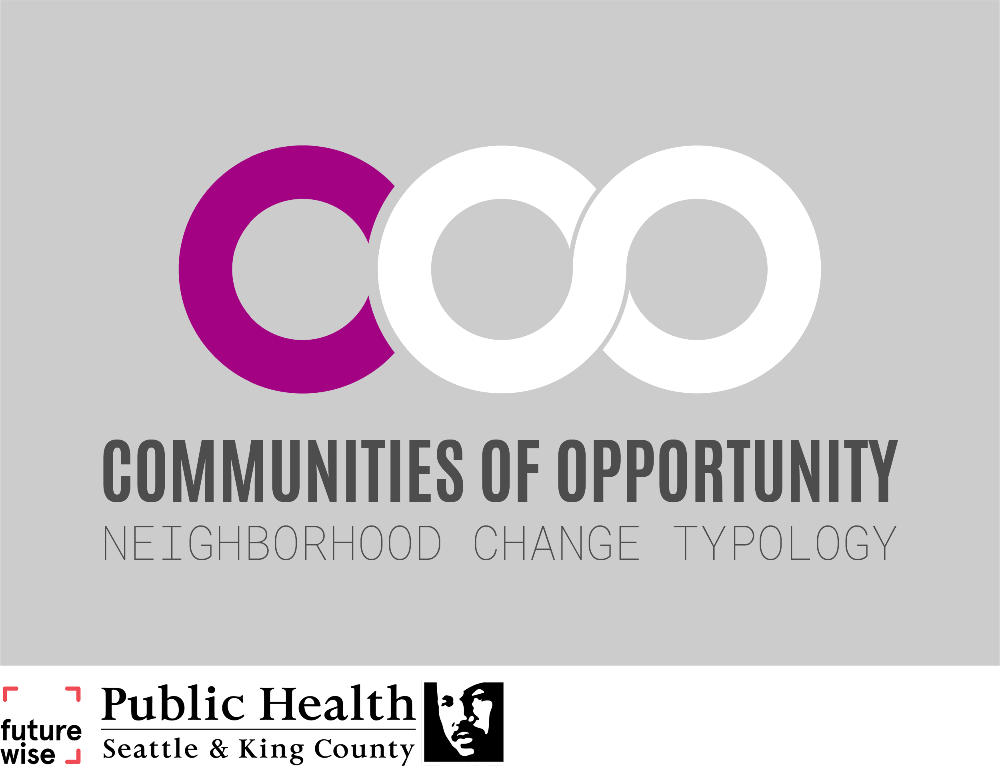 

 

# Acknowledgements {-}

Futurewise would like to thank King County Public Health and the Communities of Opportunity Program for their generous support, which made this analysis possible.

The authors would like to thank the staff members of the White Center Community Development Association for their valuable insights and critiques of the project throughout its timeline. They would also like to thank the following King County staff for their guidance and support: Andrea Akita, Public Health; Kim Tippens, Public Health; Kirsten Wysen, Public Health; Kristin Moore, Public Health; and Cheryl Markham, Department of Community and Human Services. 

Additional gratitude is extended to the members of the COO Evaluation and Advisory Group who provided feedback on the project; to Christie Most at the King County Assessor's office; and to all of the community members who contributed to the project by participating in workshops in the Fall of 2016. 

# Authors & Contributors {-}

#### [Futurewise](http://www.futurewise.org) {-}

Futurewise works to advance livable communities while protecting Washington’s most valuable natural resources. 
They collaborate strategically with legislators, government staff, community-based non-profits, Washington residents and Futurewise members to develop smart policy and advocate for responsible growth management. 
Futurewise works statewide with offices in Seattle and Spokane and a presence in both Pierce County and the Tri-Cities to create a livable and dynamic future for Washington.

Contributring staff include:

  - **Tiernan Martin**, author - for more information about the project contact Tiernan at tiernan@futurewise.org
  - **Yen Baynes**, contributor
  
#### [Puget Sound Sage](http://www.pugetsoundsage.org) {-}

Puget Sound Sage improves the lives of all families by building power for shared prosperity in the Puget Sound regional economy. 
They combine research, innovative policy and organizing to advance racial equity,stronger democracy, good jobs, affordable housing,
accessible transit and a healthy environment. 

Contributring staff include:

  - **Giulia Pasciuto**, contributor
  
#### [White Center Community Development Association](https://www.wccda.org/) {-}

The White Center CDA works to eradicate poverty and build a vibrant, economically diverse community.
They do this by:

  - Facilitating a community-driven agenda for change
  - Connecting families and community members to resources, services, and supports
  - Advocating for inclusion, engagement and resident leadership
  - Working across communities, cultures and systems
The WCCDA is committed to ensuring long-term equity and social justice through systems change for the benefit of the White Center community.

Contributring staff include:

  - **Sili Savusa**, contributor
  - **Dao Tran**, contributor 
  - **Aaron Garcia**, contributor
  - **Catherina Willard**, contributor

<!--chapter:end:index.Rmd-->

# Executive Summary {-}

## Background {-}

Gentrification and displacement shape the neighborhoods of King County, Washington's cities and unincorporated urban communities in profound and comlpex ways. While many parts of America struggle to overcome depopulation and disinvestment, over the past two decades the residents of King County have experienced a set of challenges that come with growth: rising costs of living, ballooning commute times, and housing costs that have grown much faster than most incomes [@king_county_2016_2016]. Gentrification - a term that generally refers to the alteration of a neighborhood's character in response to changes in the socioeconomic makeup of its residents, the appreciation of real estate values, and new investment by public and private actors - has occurred in many of King County's neighborhoods during this period of regional growth. While the revitalization of neighborhoods that suffer the costs of persistent poverty is an outcome worth pursuing, it is unfortunately the case that throughout history many such efforts have instead lead to the displacement of the residents and businesses from these neighborhoods.

The goal of this project is to provide a clearer understanding of which neighborhoods in King County are experiencing gentrification or are at-risk of gentrifying. The project's partners envision that this information will be used by community members and community-serving organizations in these neighborhoods as they demand displacement mitigation and community restoration policies from their local governments.

## Key Findings {-}

  1. **The people from the communities most impacted by inequities are the ones who best understand the challenges that they face. They must, therefore, play a meaningful role in deciding what solutions to pursue.**  
  2. **Over 30% of the County’s neighborhoods are either experiencing gentrification or are susceptible to it.**  
  3. **The vast majority of Communities of Opportunity (COO) neighborhoods show signs of gentrification but the specific stages of gentrification vary.**  
  4. **Each COO community has at least one neighborhood undergoing the "dynamic" stage of gentrification that is associated with on-going involuntary displacement.**  

## How to Use This Report {-}

The results of this project should be interpreted and used with caution. As the project team learned early on in the process, the neighborhood types do not represent the experience of everyone in each neighborhood. Further, the data that inform the results all contain some degree of uncertainty and - therefore - should be treated as "estimates" rather than exact representations of reality. But most importantly, the results should be understood as imperfect attempts to simplify a complex socioeconomic process in order to make improvements.^[The 20th century statistician George Box is commonly attributed for coining the phase "All models are wrong but some are useful", an aphorism that applies to this project and its findings.] The data that are publicly available for each neighborhood reflect the priorities of the public institutions that collect data (e.g., US Census, King County Tax Assessor's Office, etc.) and therefore some indicators like recent market-rate rent prices are not available. **Data are not neutral and they reflect societal power dynamics** - especially when it comes to the question of which data are collected/published and which are not [@townsend_cities_2015].

 

<!--chapter:end:00-executive-summary.Rmd-->

# Introduction

## Project History

This project was undertaken at a time when King County was experiencing both economic and population growth.^[Between 1985 and 2015, King County's population grew by 25% (1.4M to 2.1M) and it is expected to grow to 2.3M by 2031 [@king_county_2016_2016]] As with any growing region, the costs and benefits of this growth have not been experienced equally or equitably by the County's residents. The government of King County, in partnership with the Seattle Foundation, formed a partnership and began implementing the Communities of Opportunity (COO) program with the goal of "address[ing] economic and racial inequities through place-based work and systemic change"^[To learn more information about COO visit the program's [website](https://www.coopartnerships.org/about-coo)].

Two of COO's signature strategies (the practice data-driven policy making and the creation of peer-based learning communities) were exemplified by a group of placed-based organizations that met regularly to discuss the challenges and opportunities of working with community data. Known as the Evaluation and Advisory Data Workgroup (EAG)^[The name was initially just "The COO Data Workgroup" but it changed in 2018 to reflect the COO program's focus on internal evaluation], this body provided the inspiration and motivation for the project that would become the "COO Neighborhood Change Typology Report". At a meeting in early 2016, EAG participants discussed the four outcome areas that COO had identified^[These include health, housing, economic opportunity, and community connections] and the "headline indicators" of these different topics. The group felt that progress was being made on the tracking of most indicators with one glaring exception: involuntary displacement. While everyone in the group had stories of neighbors and clients who were feeling displacement pressure (or had already moved because of it), the participants noted a lack of comprehensive data confirming these lived experiences. The group decided to explore how this problem might be addressed, a process which led to the formation of a subgroup and, ultimately, the creation of this report.

### Timeline {-}

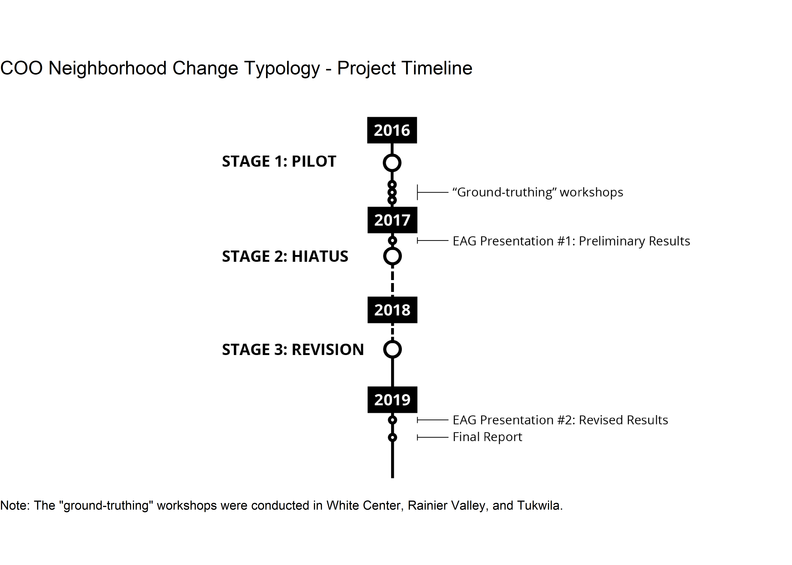

### Stage One: Pilot Project, 2016 - 2017 {-}

Between the project's beginning in 2016 and the publishing of this report in early 2019, there have been several different stages. The first might be described as the "Pilot Project" and it included many stages of its own: the formation of the project team; a literature review; consultation with experts on demographic and real estate data; the development of a preliminary model and results; testing the veracity of these results by comparing them with community members' lived experiences at "ground-truthing" workshops; and the periodic sharing of progress updates with the EAG. The Pilot Project ended with a presentation to a group of COO stakeholders that included EAG members as well as members of the program's system change committee and staff from some of COO's place-based partner organizations.

This presentation at the end of the Pilot turned out to be a critically important milestone for the project. The results of the Neighborhood Change Typology method suggested that some parts of Seattle’s Rainier Valley neighborhood and the cities of Seatac and Tukwila^[These two cities were treated as a single place-based “community” in the COO program] were at-risk for gentrification (and displacement) and that the unincorporated community of White Center was not. This finding did not match the experience that many of the members of those three communities. But in the case of White Center the findings were more than just an inaccurate characterization; as staff from the White Center Community Development Association (WC CDA) explained, these results had the potential to be “weaponized” by opponents of affordable housing and other equitable community development efforts. These staff offered to work with the project team to troubleshoot the model and look for opportunities to improve it but they also requested that the publication of the preliminary results wait until this follow-up work could be completed.

### Stage Two: Hiatus, 2017 - 2018 {-}

The next stage of the project was a 12-month period of no activity that stretched from March 2017 to March 2018. This gap in progress was largely due to the COO program’s internal reorganization work that occurred during this time period.

### Stage Three: Collaborative Revision, 2018 - 2019 {-}

In early summer of 2018, the project team reconvened and began working on a revision. Unlike the Pilot, the third stage was structured as a direct collaboration between the project team and staff from WC CDA. The project team took the lead on exploring alternative indicators that might improve the project’s model of neighborhood change and WC CDA staff provided their expertise on the specific displacement-related challenges that the members of their community faced (and continue to face). Additionally, this partnership led to productive discussions between the two groups about the challenging limitations that are present in “institutional data”^[In this context, the term “institutional data” was used to refer to data that are created by public agencies (e.g., the US Census) and it was contrasted with “community data” that don’t come from centralized, institutional sources] and how these limitations reflect the priorities of America’s dominant culture.

## Defining Gentrification & Displacement

Terms like "neighborhood change", "gentrification", and "displacement" have become increasingly commonplace in the popular discourse about American urban life but this doesn't mean that there is broad agreement on what they mean. To the contrary, the academic literature on this subject contains a passionate debate around the definition of these words as well as the forces that cause them. This project benefits from the scholarship of researchers like Dr. Lisa Bates - who developed the method that this project is modeled after - and Dr. Miriam Zuk  - who, along with her colleagues, produced a comprehensive literature review on these subjects [@bates_gentrification_2013; @miriam_zuk_gentrification_2015].

### Influential Works {-}

Rather than attempting to summarize the wide spectrum of thought on this topic, this report highlights the specific pieces of literature that contributed most to the authors’ understanding of this topic. 

First and foremost, Dr. Bates’ 2013 report titled “Gentrification and Displacement Study: Implementing an Equitable Inclusive Development Strategy in the Context of Gentrification” provides an excellent overview of the scholarship before laying out a clear, reproducible method of “operationalizing” the concept of gentrification. Bates’ work itself builds on a 2005 article by Dr. Lance Freeman which introduced a focused set of socioeconomic and real estate indicators to measure gentrification [@freeman_displacement_2005]. 

In addition to defining the “neighborhood change typology” model, Bates frames her analysis as a tool for selecting public policies that will promote equitable development rather than exacerbate displacement. She summarizes the public sector’s role in gentrification and recommends: a “market-conscious” strategy involving  the monitoring of housing market indicators; the creation of regulations and incentives to “leverage limited housing resources”; and public support for community partner organizations as they build their capacity to lead anti-displacement efforts [@bates_gentrification_2013, pp.18-25].

In addition to Bates' and Freeman's respective works, the literature review by Dr. Miriam Zuk et al describes the scholarship landscape on neighborhood change, gentrification, and displacement. This work explains the different conceptions and helps dispel any notion that there might be a universally accepted method for measuring any of these phenomena. Dr. Jackelyn Hwang’s study of homeowner mobility in Philadelphia, which uses anonymized credit data from the Federal Reserve Bank of Philadelphia, illustrates the extraordinary degree of methodological ingenuity and access to private data that is required to “track” displacement at the household level [@ding_effects_2018].

Lastly, the City of Seattle’s 2016 “Growth and Equity” report illustrates a different methodology applied to part of the study area of this report [@city_of_seattle_seattle_2016]. Although Seattle’s assessment of displacement risk is also informed by Dr. Bates’ work in Portland, OR; it uses a wide variety of indicators to produce an estimate of the relative _amount_ of risk rather than  the relative _type_ of susceptibility (i.e., a “continuous” scale rather than a “discrete” one).

### Key Terms Defined {-}

While the authors acknowledge the existing debate around these terms, for the sake of clarity this project uses the following definitions when referring to each term:

  - **Neighborhood Change:** a substantial shift in the socioeconomic and/or racial composition of a neighborhood’s residents and businesses along with the elements of the built environment that make up the neighborhood’s physical space.
  - **Gentrification:** the socioeconomic “upgrading” of a neighborhood’s demographics combined with a shift from low to high real estate values. While gentrification in the US context is often associated with the racial turnover of majority people of color neighborhoods [@miriam_zuk_gentrification_2015, pp.7-9], this project does not limit its definition of gentrification to racial demographic change.^[While this project doesn’t _require_ evidence of racial turnover in order for a neighborhood to be considered “gentrifying”, this study shows that increases in white, non-hispanic population are common in King County's gentrifying census tracts. See the #methods section for a detailed explanation of how this project defines gentrification]
  - **Displacement:** “the involuntary relocation of current residents or businesses from their current residence” [@city_of_seattle_seattle_2016, p.4]. This may be caused by the physical destruction of a home, the process of becoming “priced out” of a neighborhood, or the loss of an individual’s community and community-serving institutions. While studies show that the causality between gentrification and displacement is less clear than the popular narrative would suggest [@ding_gentrification_2016, p.6], this project nevertheless follows Bates' example of treating displacement as a negatives outcome resulting from the the process of neighborhood gentrification [@bates_gentrification_2013, pp.9-11].

Other terms used throughout this report include:

  - **Census Tract:** according to the US Census Bureau, census tracts are "small, relatively permanent statistical subdivisions of a county or county equivalent and generally have a population size between 1,200 and 8,000 people, with an optimum size of 4,000 people" [@us_census_bureau_geography_nodate]. For the purposes of this project, census tracts are used as a geographic proxy for neighborhoods.
  - **Indicator:** an indicator is the "representation of statistical data for a specified time, place or any other relevant characteristic, corrected for at least one dimension (usually size) so as to allow for meaningful comparisons... It is a summary measure related to a key issue or phenomenon and derived from a series of observed facts" [@eurostat_eurostat_nodate]. For example, this project uses the percentage of a census tract's population that are low-income as an indicator of vulnerability to displacement.
  - **Model:** according to Professor Daniel Kaplan of Macalester College, a model is "a representation for a particular purpose" [@kaplan_statistical_2009, p.6]. This project builds a "classification model" of neighborhood change in order to better understand what displacement mitigation and neighborhood revitalization policies to consider adopting in specific neighborhoods throughout King County. The project's model is grounded in a conceptual understanding of how neighborhood change works [see @freeman_displacement_2005; @bates_gentrification_2013; and @miriam_zuk_gentrification_2015] and model's results are determined by the indicator data.^[A common aphorism in the field of statistics says that "all models are wrong, but some are useful" [@box_science_1976]. This phrase means that models are _necessarily_ a simplification of reality and, therefore, they should be judged not by their accuracy alone but by their ability to represent a phenomenon with enough accuracy to be useful.]

## Project Summary

The primary goal of this project is to provide the COO partners with a clearer understanding of which neighborhoods in King County are experiencing gentrification or are at-risk of gentrifying. The gentrification of a neighborhood often leads to the removal of many of the residents (i.e., displacement), preventing them from receiving the benefits of the changes and improvements that characterize neighborhood revitalization efforts. As this region's economic and population growth changes the composition of neighborhoods, it is critical that communities and their governments work together to ensure that the costs and benefits of growth are distributed equitably.

In addition to the question of which neighborhoods are at-risk or gentrifying, this project also tries to provide a useful description of what stage each neighborhood is at in the process. The concept of a "neighborhood change typology" that is actionable and connects to anti-displacement policies comes directly from the work of Dr. @bates_gentrification_2013 [p.9]. Importantly (although perhaps counter-intuitively), this project does not try to measure the number of displaced households, nor does it try to predict displacement rates. While those two data points would be useful information and would fit nicely into the COO "headline indicator" framework, this project's literature review suggests that there is not yet a methodologically sound way to measure them at the project's geographic scale.

Because this project operates within the framework of the COO program, it focuses specifically on the census tracts^[Census tracts are a geographic unit created used by the US Census to organize its survey data. Although these geographies are often used as proxies for neighborhoods, they almost never align with the actual boundaries of any given city's neighborhoods. For that reason, they should be consider a "best approximation" of neighborhoods rather than an exact representation.] that characterize the three original COO place-based communities. The purpose is not to compare one community against another but rather to provide a data-driven foundation for displacement mitigation and community restoration policies.

Finally, the project is intended to be clear, accessible, and reproducible; particularly to staff members of the COO community partners and the residents of the neighborhoods in those communities. The data and code files used to create the model and findings are published online and open to those who want to explore them.

<!--chapter:end:01-introduction.Rmd-->

# Methods

## The Portland Model

This project begins with the method developed by Dr. Lisa Bates in partnership with the City of Portland, OR. As described by @bates_gentrification_2013 [p.59], 

> The typology assessment began with a retrospective look at neighborhood change in Portland to assess whether a small number of measured indicators could represent the changes observed today. … Measured indicators were chosen to represent the “robust, yet parsimonious” approach and to align with policy-relevant metrics (such as HUD income standards for housing assistance).

This approach uses the neighborhood (approximated by census tracts) as the unit of analysis, which was part of the reason it appealed to the project team.

Additionally, the method provides a clear conceptual structure to the process of neighborhood change. This structure is a three-level hierarchy^[While the project author characterizes Dr. Bates’ conceptual model as a hierarchy, Bates herself does not use that term in her report] and it enables Bates to develop definitions and assign “measured indicators” to them. 

The structure's levels are:

  1. **Statuses:** Long-term low cost/low income; at-risk or gentrifying; long-term high cost/high income
  2. **Stages (of neighborhood change):** Early-, Mid-, and Late-stage
  3. **Types (of neighborhood change):** Susceptible, Early Type 1, Early Type 2, Dynamic, Late, and Continued Loss

The diagram below illustrates how elements of this hierarchical conceptual structure relate, pairing them with the results of Bates' 2013 assessment:

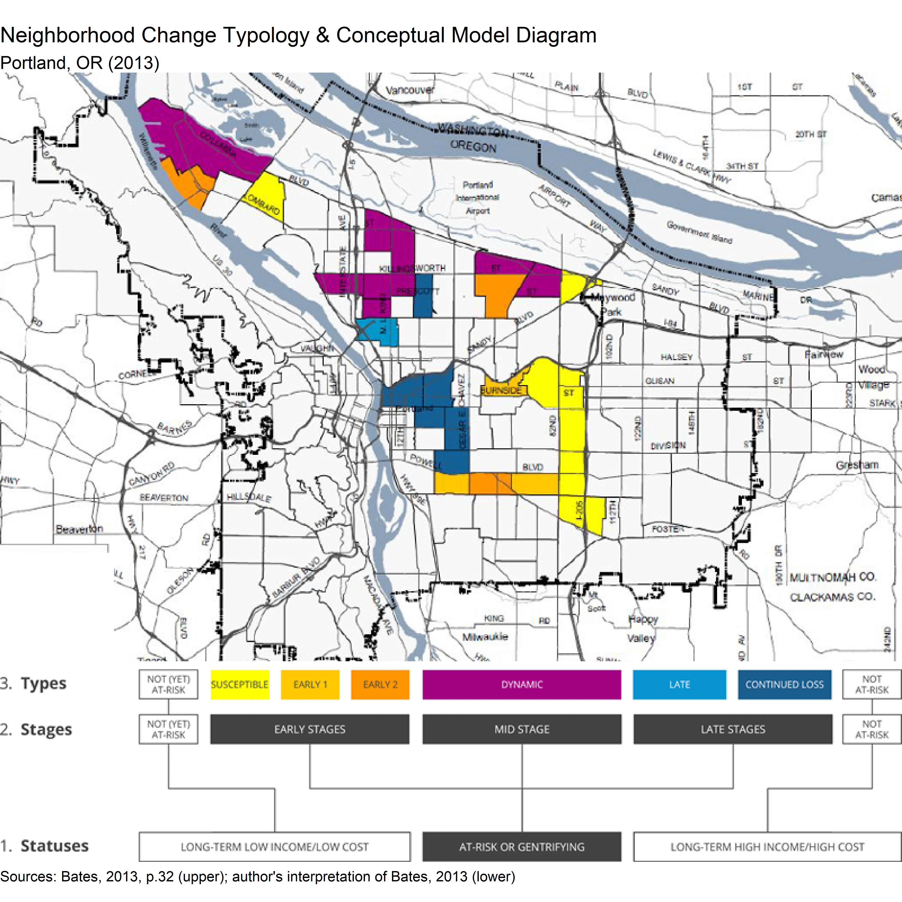

(\#fig:methods-concept-diagram)Bates' Neighborhood Change Typology Conceptual model

### Statuses {-}

A neighborhood’s status simply describes whether or not it is considered to be at-risk for gentrification or not. Neighborhoods that experience long-term disinvestment and poverty face many challenges but the threat of gentrification only applies when these conditions are combined with a housing market that begins to rapidly appreciate in value. Similarly, a long-term high cost neighborhood may experience home value appreciation but without a shift toward higher-income and highly-educated residents this case doesn’t fit the model of gentrification. The characteristics of a gentrifying or gentrified neighborhood are “housing market changes, economic status changes, and demographic changes … that alter its character” [@bates_gentrification_2013, p.9].

### Stages {-}

The stages of gentrification describe the changes that are occurring at a high level. Early-stage neighborhoods are at-risk or just beginning to show the signs of gentrification; Mid-stage neighborhoods are experiencing active gentrification pressures; and Late-stage neighborhoods have already progressed from low housing market value to high and have little or none of the previous community left.

Bates connects each stage to a set of policies and strategies that communities can advocate for. This connection between the conceptual model and potential solutions is significant strength of Dr. Bates’ method.

### Types {-}

The six types in the Neighborhood Change Typology represent the full spectrum of possibilities for at-risk and gentrifying neighborhoods. While a given neighborhood could (in theory) progress through all six stages linearly, the typology does presume that to be the case; change happens at different rates and in different “flavors” in different neighborhoods. 

### Dimensions of Neighborhood Change {-}

The characteristics of a neighborhood that determine its type are called the "dimensions". The dimensions of neighborhood change include:

  1. **Vulnerability to Housing Displacement:** whether the neighborhoods residents have relatively high percentages of groups that have historically been less able to resist displacement pressure. These groups include: 
      a. Adults with low levels of education (less than a Bachelor's degree)
      b. People of color^[Throughout US history, racist actions taken by governments, businesses, and individuals have forced people who aren’t white to live in certain neighborhoods. Examples of these types of actions - including the redlining of communities of color, the placement of racially restrictive covenants on property deeds, and the physical degradation (or destruction) of people of color neighborhoods in pursuit of public infrastructure projects - are present in the history of many places in King County and elsewhere [see @taylor_forging_1994; @chin_seattles_2001]. While a person’s race or ethnicity should not (in theory) make them any more or less vulnerable to displacement, the legacy of systemic racism has significant, inter-generational negative influence on the lives of people of color [@chetty_race_2018] and therefore this project treats race as an indicator of vulnerability to displacement.] 
      c. Low-income households
      d. Renter households
  
  2. **Demographic Changes:** whether there is a relatively large change in multiple demographic groups. These are the groups that have historically been more able to resist displacement pressure and more likely to participate in neighborhood change as gentrifiers. They include:
      a. White people
      b. Adults with more formal education (a Bachelor's degree or higher)
      c. Medium/high-income households
      d. Owner households
      
  3. **Housing Market Appreciation:** whether the neighborhoods housing market is shifting from a low value state to high value. Bates measures this change using the home values themselves (in comparison to all neighborhoods) and the rate of change in these values (i.e., appreciation) [@bates_gentrification_2013, p.28]. The Housing Market Appreciation dimension of neighborhood change can itself be divided into types:
      a. **Adjacent neighborhoods:** low/moderate value neighborhoods with low appreciation rates that are next to high value or rapidly appreciating neighborhoods^[The Adjacent type is intended to capture the "spillover effect" where the proximity to high value markets draws buyers to a nearby low value neighborhood [see @bates_gentrification_2013, p.61]]
      b. **Accelerating neighborhoods:** low/moderate value neighborhoods with high appreciation rates
      c. **Appreciated neighborhoods:** high value neighborhoods that appreciated from low value status over a longer period of time

## The (Revised) Communinities of Opportunity Model

The model that Dr. Bates developed for the City of Portland served as a foundation for this project and for many others.^[see @city_of_seattle_seattle_2016] However, given that this approach uses a limited number of indicators to capture a complex process, it is necessary to adapt the method slightly to fit the context in which it is applied.^[When developing the model for Portland, Dr. Bates began with a “retrospective look” at neighborhood change in that city and this process informed the selection of indicators; see @bates_gentrification_2013 [p.59]] After considering the context of King County and receiving constructive criticism of the preliminary model, the project team decided to implement the following adaptations to the Portland model:

  1. **Use the most recent data available**
  2. **Add indicators of housing market appreciation** that might capture faster rates of change
  3. Where possible, **make a distinction between the experience of renter and homeowner households** (note: this goal was not fully achieved)
  
### Most Recent Data {-}

The Portland model uses data from the two sources: the US Census^[The sources of the US Census data used in the Portland model include both the American Community Survey and the Decennial Census] and the Department of Housing and Urban Development (HUD) Comprehensive Housing Affordability Strategy (CHAS). The vulnerability indicators used the most recent 5-year spans while the indicators of demographic change and housing market appreciation used decadal samples.

In contrast, the COO Revised Model uses data from one additional data source (the King County Tax Assessor’s Office) and uses the most recent data from that source as well as the US Census. For example, instead of comparing the change in the percentage of white households between 2000 and 2010, the model compares the two most-recent (non-overlapping) 5-year spans: 2007-2011 and 2013-2017^[Note: the 2008-2012 5-year span could have been used but the project team decided not to because the potential increase in recency didn’t outweigh the cost of revising the data processing code. This change could be made to future improvements of the model.] The indicators that rely on data from the tax assessor use shorter, more recent time periods than the Census-based indicators. 

### Appreciation Indicators {-}

While the Portland model relied on US Census surveys responses, the COO Revised model primarily uses data from the King County Tax Assessor. The tax assessor data captures the entirety of the County’s housing properties and the valuations are updated regularly according to the  County’s algorithm. Additionally, this data includes all sales of housing properties along with relevant metadata like the sale price, the size of the home, and the “instrument” of the sale (e.g., foreclosure, divorce settlement, etc.)^[See the metadata for the ‘Real Property Sales’ file listed on King County’s Assessor Data Portal: <https://info.kingcounty.gov/assessor/datadownload/desc/Real%20Property%20Sales.doc>].

In addition to adding a source of more recent housing market data, this project deviates from the Portland model by using multiple indicators in the definition of each housing market appreciation type. For instance, a neighborhood with a “High” 2018 value may either have a high median assessed value or a high median sale price per square foot (both measures are relative to all census tracts in King County). Similarly, this project adds a measurement of the percentage of homes sold in a neighborhood in the past three years as an alternate indicator of a “hot”/appreciating market. The inspiration for this additional appreciation indicator comes from Bates’ recommendations for the “monitoring and tracking” of new market sales activity [@bates_gentrification_2013, p.35]. The COO Revised Model refers to this sale rate indicator as “short-term” appreciation and the home value indicator as “medium-term” appreciation, but the presence of a high value in either indicator is interpreted by the model as an “appreciating” housing market type.

### The Renter Experience {-}

The Portland model includes housing tenure (i.e., whether a household owns or rents their home) in the Vulnerability and Demographic Change dimensions of neighborhood change. However, its Housing Market Appreciation dimension does not include rent prices. Home rent prices are challenging data to obtain both because there is no systematic requirement that landlords disclose rent prices publicly and because they change dynamically in response to the local housing market. An argument could be made that rent prices are loosely correlated with the values of owner-occupied homes, so using only the latter data will still capture most of the housing market conditions for a given neighborhood. 

Nevertheless, this project made an effort to include rent prices in the Housing Market Appreciation dimension of neighborhood change. This decision was made after receiving feedback during all three of the “ground-truthing” workshops and from the project’s partners at the White Center Community Development Association that rent prices in this region are growing at a rate that leaves many working class and low income households with no choice but to move away from their neighborhoods. 

The project team tried to identify a reliable source of rental prices for King County but was unsuccessful in this effort.^[Similar projects like @city_of_seattle_seattle_2016 used data from the now-closed market research firm Dupre and Scott. Other data sources that are currently available do not provide data at the census tract geographic scale.] Instead, data from the American Community Survey 5-year spans was included in the model although it does not meet the projects requirements for “freshness” (i.e., rents change too dynamically to use a sample of survey responses collected over the span of five years).

Finally, this model makes a distinction between neighborhoods that are predominantly multifamily housing markets and those that are either mostly single family or mixed markets. The primary reason for this change is that several of King County’s census tracts are almost entirely^[A simple analysis of the share of housing units in multifamily buildings (by census tract) led the project team to select >=90% as the threshold for determining that a tract should be considered “mostly multifamily”. See \@ref(app-data-viz-pct-mf) for details.] composed of multifamily homes and therefore the use of median single family home values as an indicator of market appreciation would yield inaccurate results. Instead, the COO Revised model uses a combination of rent prices and residential condominium values and sale prices for these neighborhoods. This allows the model to more accurately describe the stage of gentrification for neighborhoods located near central business districts (primarily Seattle’s CBD) while avoiding the inadvertent "erasure" of the experience of these neighborhoods' residents.

## Model Comparison

The following table captures the similarities and difference between the Portland model and this project's adaptation of it. The primary distinctions between the COO Revised model and the Portland model are the use of more recent data, the addition of alternative indicators of housing market appreciation, and the divison of the model between neighborhoods with mostly multifamily housing and those characterized by eithr mostly single family or a mixture of housing types.

preserve5453b372f6ea6465

## Limitations

This method is intended to guide policy makers and community members toward effective displacement mitigation strategies by categorizing neighborhoods according to their stage in the process of neighborhood change. As with any approach that attempts to model a complex system (in this case, a neighborhood), the results of this method should be interpreted cautiously and its limitations must be acknowledged.^[For a relevant summary of the limitations of displacement risk composite indices, see @city_of_seattle_seattle_2016 [p.15] ]

**The most important limitation is the absence of contextual information.** Simply put, if a neighborhood is experiencing gentrification and displacement but those changes are not captured in Census/Assessor’s Office data then this model will be wrong because it only “knows about” a small set of indicators. This method does not include a way to add contextual data from the communities that are being displaced to refine its typology classification. If used to inform public policy, the model’s results should _complement_ the results of direct community engagement - not replace them.

**The use of small geographic units (e.g., census tracts) increases the uncertainty of the data.** While there appears to be some consensus in the academic scholarship that gentrification is a neighborhood-based dynamic [@miriam_zuk_gentrification_2015], the use of neighborhood-sized samples of American Community Survey data introduces significant statistical uncertainty into the results. Similarly, the use of data collected during wide spans of time (five years for the ACS data) restricts the ability of the model to reflect current on-the-ground conditions. This limitation is particularly relevant to highly dynamic indicators like rent prices but is also has implications on the data's ability to reflect the rapid pace of shifting neighborhood demographics. 

**This method's reliance on _relative_ measures might discount the impact of _absolute_ changes.** The median and quintile values provide a useful baseline for comparing the County’s tracts but this approach risks underestimating the impacts of region-wide growth. For instance, if most neighborhoods are experiencing rising housing costs while household incomes remain flat then residents will experience pressure to relocate. In this scenario the comparison of one neighborhood to the rest may be less important than the measurement of absolute change.

**This method produces _descriptive_ - not predictive - results.** The results describe the demographic and housing market pattern of neighborhoods; they do not predict the precise number of households that might be displaced, nor do they directly measure the number of households that have been displaced already.

**The absence of recent, systematically collected rent price data weakens the model’s ability to accurately portray changes in rental housing markets.** While the project team tried to find a better source of rent data than the ACS, that effort was ultimately unsuccessful. The procurement of rent price data (past and present) for the entirety of King County is beyond the scope of this project.

**The model narrowly focuses on indicators of residential neighborhood change but businesses experience gentrification and displacement pressure as well.** The results should not be interpreted as evidence of changes in the composition of a neighborhood’s business community [@bates_gentrification_2013, p.64].^[@bates_gentrification_2013 [p.64] mentions the potential for conducting a “neighborhood-serving business analysis” using data from the US Census Bureau’s North American Industry Classification System (NAICS)] 
 
## Reproducibility & Open Source Materials

The raw data and an R package containing the project's code files are available to download at 
https://doi.org/10.17605/OSF.IO/SJ7N9

<!--chapter:end:02-methods.Rmd-->

# Results

## COO Revised Model (Single-Family/Mixed) Results

The COO Revised Model identifies many neighborhoods in King County as either "at-risk" or gentrifying. 

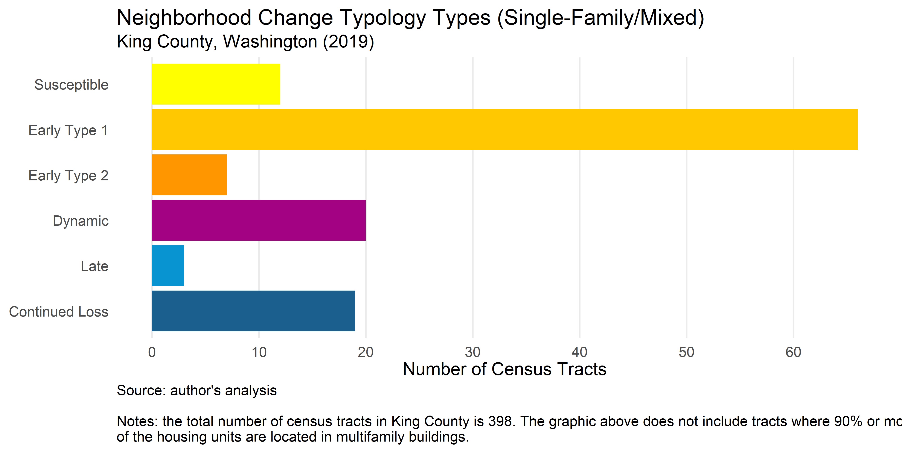

(\#fig:findings-type-counts)The number of tracts in each typology type

Of the 398 census tracts in King County, just over 30% of them show signs of either being vulnerable to gentrification or experiencing this process right now (or in the recent past). Geographically, these neighborhoods are mostly concentrated in southwestern part of the county although some Late-stage gentrification tracts are identified in the communities surrounding Lake Sammamish. 

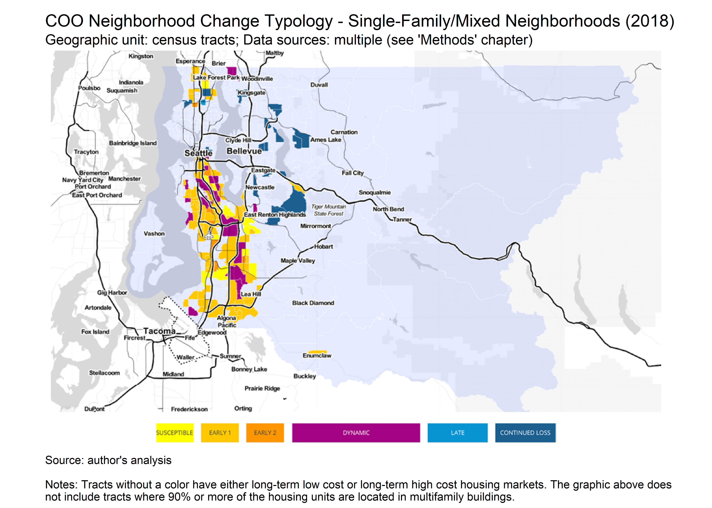

(\#fig:findings-kc-map)COO Neighborhood Change Typology - Single-Family/Mixed (2018)

Of the 127 neighborhoods identified as being "at-risk" or gentrifying, the majority (67%) fall in the Early stage of gentrification (Susceptible, Early Type 1, or Early Type 2), while 16% are classified as Mid-stage (Dynamic) and 17% are Late-stage (Late or Continued Loss). 

Geographically, these neighborhoods appears to be split into three clusters: 

  1. **Southwestern King County:** most of the tracts in this area are either Early- or Mid-stage
  2. **East of Lake Washington:** the vast majority of these tracts are in the Late stage
  3. **North Seattle, Shoreline, and Bothell:** tracts in this cluster span all three stages of gentrification from Early to Late

## COO Revised Model (Multifamily) Results

There are far fewer neighborhoods included in the “mostly multifamily” model results. This is because most neighborhoods in King County have a mixture of single-family and multifamily homes, making it relatively rare to find one where over 90% of the homes are located in multifamily buildings.^[As previously mentioned in the \@ref(results) section, the 90% threshold is an arbitrary one but it was arrived at through an analysis of the data. See \@ref(app-data-viz-pct-mf)  for detail of that analysis.]

The tracts included in the multifamily version of the COO Revised Model are geographically concentrated in Seattle and they include all three stages of gentrification (Early, Mid, and Late). However, as the figure below demonstrates, only four of the six types of neighborhood change are identified in the "mostly multifamily" neighborhoods.

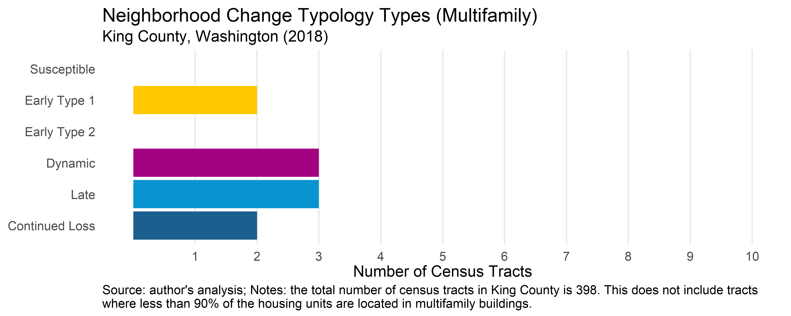

(\#fig:findings-type-counts-mf)The number of tracts in each typology type (multifamily)

The neighborhoods are located either within Seattle's "city center" area (broadly defined) or within the University District^[The “city center” is, in this case, being defined here to include the range of neighborhoods from Chinatown International District in the south to South Lake Union in the north; it also includes the western-most part of Capitol Hill].

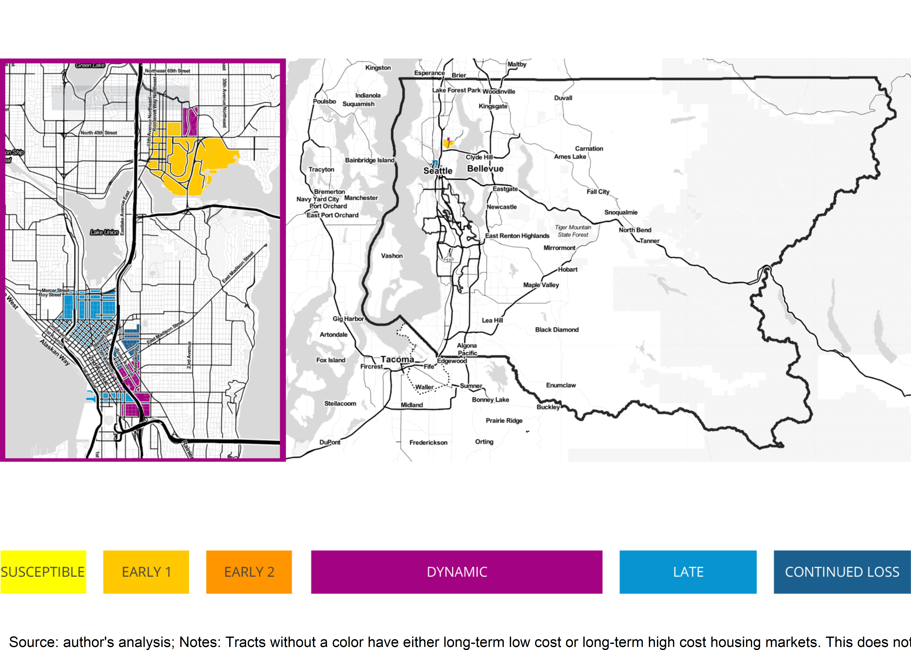

(\#fig:findings-kc-map-mf)COO Neighborhood Change Typology - Multifamily (2018)

## COO Revised Model Results By Community

The COO program’s three original place-based communities are White Center, Raininer Valley, and the combined residents of Seatac and Tukwila. These three communities include approximately 167,000 residents^[Using data from the 2013-2017 American Community Survey, the author's calculations show the population of the census tracts included in the three original COO place-based communities to be 166,967 (+/-2,698) people] from four separate jurisdictions and countless distinct racial, ethnic, and cultural communities.

The model identifies 28 of the 34 census tracts in these three communities as being either “at-risk” or gentrifying. Half of those 28 tracts fall into the Early Type 1 type while another quarter are identified as Dynamic (Mid-stage gentrification). Unlike the county as a whole, no Late-stage gentrification tracts are identified within the three original COO communities.

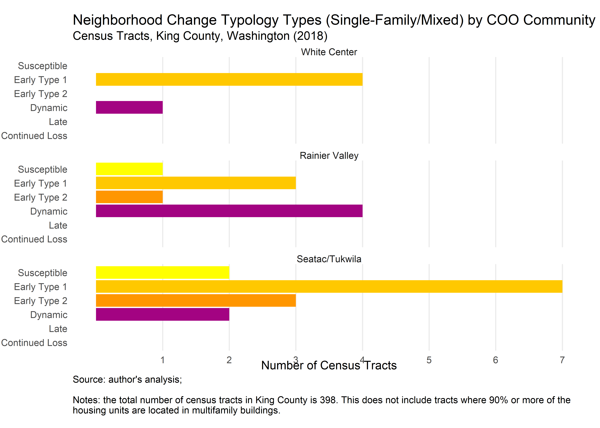

(\#fig:findings-type-by-comm-counts)The number of tracts in each typology type by COO Community

As indicated in the graphic below, no clear pattern is present in the geographic distribution of the neighborhood change types.

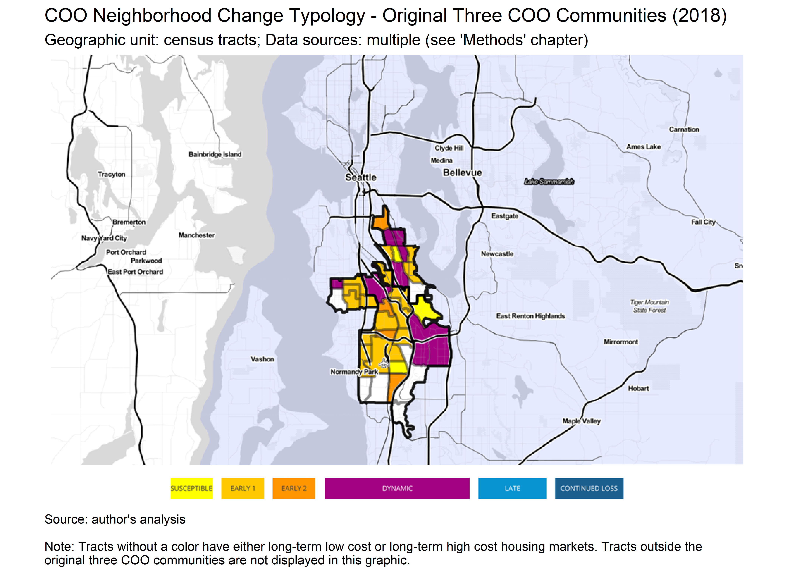

(\#fig:findings-typo-coo-comms-map)COO Neighborhood Change Typology - Original Three COO Communities (2018)

The following maps display the COO Revised Neighborhood Change Typology (2018) results for the original three place-based communities.

### COO Revised Model Results: White Center {-}

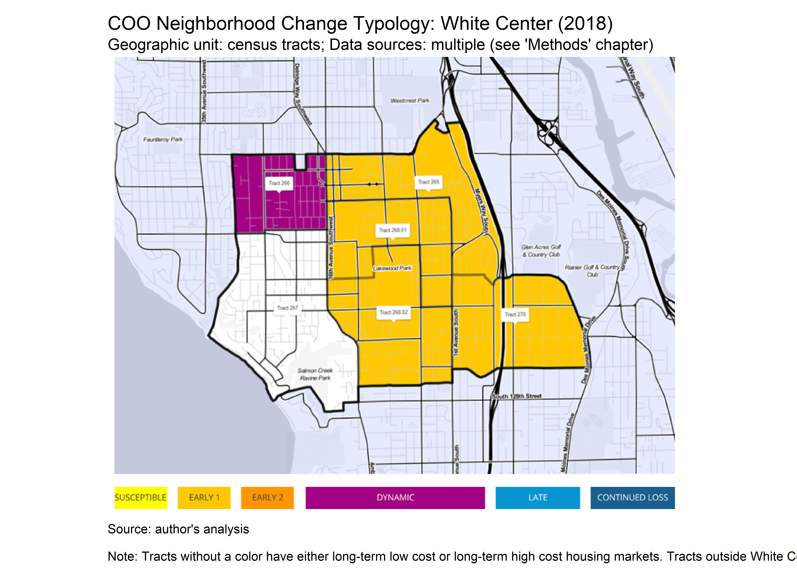

(\#fig:findings-wc-map)COO Neighborhood Change Typology: White Center (2018)

### COO Revised Model Results: Rainier Valley {-}

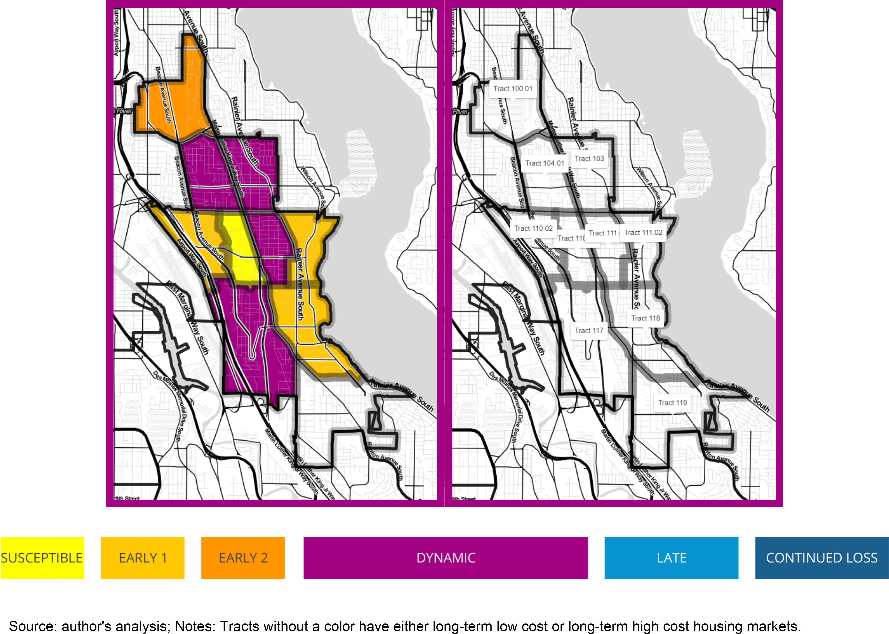

(\#fig:findings-rv-map)COO Neighborhood Change Typology: Rainier Valley (2018)

### COO Revised Model Results: Seatac & Tukwila {-}

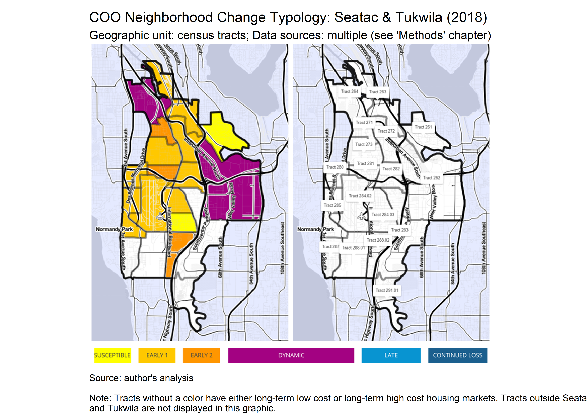

(\#fig:findings-stk-map)COO Neighborhood Change Typology: Seatac/Tukwila (2018)

<!--chapter:end:03-results.Rmd-->

# Discussion

## Partnership & Process 

Before discussing the project’s results (and their policy implications), it may be beneficial to consider the partnership and process that made the results possible. 

Data-driven analyses like this one have no shortage of technical challenges to overcome^[For a disucssion of the technical challenges faced by this project, see the [limitations] section of this report] but perhaps an even greater obstacle is the formation of the type of partnership that brings together the necessary expertise to complete the project responsibly. This project benefited from its genesis in the COO Evaluation and Advisory group, where staff members of community-based organizations helped to shape it with their knowledge of the three COO communities. Nevertheless, even though the project team had access to this pool of local expertise, the Pilot phase’s preliminary results did not reflect the lived reality of many of these communities. These early results posed a potential threat to the community development efforts of organizations like the White Center Community Development Association. If their staff had not pointed out the flaws in these early results (and later brainstormed solutions with the project team), the project’s results would have been less accurate and could have been used as evidence _against_ the need for displacement mitigation policies and equitable public investment. 

This experience underscores what might be the most significant finding of the project: 

#### 1. The communities most impacted by inequities understand the challenge that they face and they must, therefore, play a meaningful role in the solution. {-}

A classification model built with institutional data (like the COO Revised Neighborhood Change Typology) can be useful, but its utility depends on the participation of members of the communities that are experiencing gentrification and displacement. Advisory groups, “ground-truthing” workshops, and flexibility on the part of the project team are all necessary components of a project like this one.

Lastly, this project’s method relies on a small group of people using data from public institutions to produce information about many neighborhoods. The experience of undertaking this project has led its team to conclude that there is significant value in pursuing other research methods; ones that center the members of the most impacted communities and invest in their exploration of the issues that matter most to them. The approach known as “research justice” offers great potential in the pursuit of equitable community development and other related goals held by the Communities of Opportunity program and the government of King County.^[For more information about research justice, see @jolivette_research_2015 and @coalition_of_communities_of_color_leading_2018]

## Typology Findings

#### 2. Over 30% of the County’s neighborhoods are either experiencing gentrification or are susceptible to it. {-}

According to the project’s definition of “gentrification”, this means that a substantial portion of the County is experiencing an upward shift in socioeconomic demographics combined with housing market appreciation. Gentrification occurs in changing neighborhoods that are neither persistently low-income/low-value nor persistently high-income/high-value; in and of itself, it is not necessarily a bad thing.  

**However, history suggests that without community mobilization and strategic intervention by local governments, many community members in these changing neighborhoods will be forced to relocate just as the benefits of revitalization begin to emerge.**

The identification of 127 census tracts that meet the criteria for being “at-risk” or gentrifying suggests that substantial investment in anti-displacement and neighborhood revitalization initiatives should be undertaken. The large concentration of Early- and Mid-stage neighborhoods in the southwestern part of the county reaffirms what many of the “ground-truthing” workshop participants said: individuals, families, and whole communities are being “pushed“ out of Seattle’s South End neighborhoods and this shift seems to be rippling through the communities to the south. A similar effect may be occurring in some of Seattle’s North End neighborhoods near the city’s border with Shoreline, although the model suggests that a few of these communities are already in the Continued Loss stage of neighborhood change. 

Seattle’s Central Area neighborhood (also known as the Central District) shows a combination of Late and Continued Loss types - a result that only reflects the most recent part of the decades-long displacement of Seattle’s original African American community [@taylor_forging_1994; @mcgee_seattles_2007].

Lastly, the geographically dispersed group of Continued Loss type neighborhoods east of Lake Washington is unexpected and warrants further investigation.

#### 3. The vast majority of COO neighborhoods show some signs (at least) of gentrification. {-}

Of the COO neighborhoods, the most prevalent type is Early Type 1. This indicates that a neighborhood has relatively large populations that are vulnerable to displacement; has not yet seen a substantial demographic shift toward whiter, more affluent, better educated home owners; and still has low or moderate home values but is seeing high rates of short-term or medium-term home value appreciation. Put plainly, the neighborhoods are “on track” to gentrify and may soon experience significant displacement pressure (if they aren’t already).

The introduction of the additional indicators of appreciation (i.e., change in sale price per sqft and the percent of homes sold) improves the model’s ability to identify housing markets with high turnover rates.^[see Figure \@ref(fig:app-data-viz-comm-hous-hist) for a comparison of housing market indicators by COO community] The large number of Early Type 1 neighborhoods suggests that many places with high concentrations of vulnerable people are also the places where the housing market is “heating up”. This methodological change accounts for much of the different between the preliminary results produced during the Pilot phase and the final model results.

#### 4. Each COO community has at least one neighborhood undergoing the type of active gentrification associated with involuntary displacement. {-}

While evidence of substantial demographic change is present in only 7 of the 34 COO community tracts, each of the communities has at least one such changing tract. As with the Early Type 1 neighborhoods, the new housing market appreciation indicators help the model to better identify Dynamic neighborhoods. While the demographic change indicators cannot by themselves be used as measures of displacement, they strongly suggest that vulnerable groups are being displaced from these neighborhoods. The Rainier Valley, which has four Dynamic tracts, should be treated as a community undergoing active gentrification and policies that are appropriate to this gentrification stage should be explored by community members and policy makers.

## Policy Implications

The goal of this project is to provide a consistent description of gentrification so that community leaders and policy makers can design effective intervention strategies. The project adopts Dr. Bates’ neighborhood change typology framework (with modifications) and it also includes her “Policy Toolkit” to guide discussions about which tools and strategies to evaluate for the COO communities. As Bates states, the decisions about which tools to use and how to prioritize scarce public resources are inherently political and therefore must be made in partnership with the most impacted communities [@bates_gentrification_2013, p.56]. 

Prescriptive policy recommendations for specific communties are beyond the scope of this project but the following tables, when paired with the typology results, may be useful in assessing appropriate policy alternatives.

Please note that the following tables are direct transcriptions from @bates_gentrification_2013:

#### 1. Plan for inclusive, equitable development {-}
preserve0d4b2b0d41c5321d

#### 2. Increase/preserve opportunities for affordable housing {-}
##### 2.1 Generate revenue for housing programs {-}
preservea532c1ca44366b99

##### 2.2 Create new affordable housing {-}
preserve8e213c06b6643ee0

##### 2.3 Preserve affordable housing {-}
preserve4eb9162a90f497f4

#### Final word on inclusive policy-making {-}

The importance of including people from the communities experiencing the disruptive impacts of displacement bears repeating. During the course of this project, the authors have witnessed first-hand how valuable and necessary it is to have local expertise “at the table“ when making these sort of decisions. The COO program is designed to embody this approach, as exemplified in their six strategies:

>  * Establishing community-based priorities
>  * Tapping into existing community expertise and leadership
>  * Strengthening community capacity for advocacy and to take on local challenges
>  * Systematizing a collaborative approach between communities and institutions
>  * Shaping policies to promote equity and positively impact our communities
>  * Bringing new resources into communities ^[For more details on the COO's approach see @noauthor_communities_nodate]

As mentioned in the Section \@ref(limitations) of the Methods chapter, if the results of this project are used to inform public policy, it is critical that they _complement_ the findings of direct community engagement - not replace them.

<!--chapter:end:04-discussion.Rmd-->

# Conclusion

The disruptive threat of displacement is confronted by communities throughout King County. The Communities of Opportunity program provides a framework for the formation of public/private/community-based relationships that are uniquely capable of confronting systemic challenges like gentrification and involuntary displacement. 

In 2016, a working group of community-based organizations from White Center, Rainier Valley, Seatac, and Tukwila decided to prioritize the monitoring of involuntary displacement in their neighborhoods. This led to a three-year endeavor with plenty of challenges along the way but ultimately the project arrived at its stated goal: a data-driven typology of neighborhood change that can inform current and future anti-displacement work.

The method, based on the work of Dr. Lisa Bates in Portland, OR; categorizes neighborhoods according to their gentrification stage (Early-, Mid-, and Late-stage) and the specific type of neighborhood change that they reflect. In 2016 the project team developed a preliminary model but it failed to identify the type of gentrification that was occurring in communities like White Center. The project began again in 2018, this time with a partnership between the initial project team (led by Futurewise) and a group of staff members at the White Center Community Development Association. Together, the partnership developed a revised version of the neighborhood change typology was developed that incorporated new indicators of housing market change.

The results of the project suggest that over 30% of the neighborhoods in the cities and unincorporated communities of King County are experiencing some stage of gentrification. Within the COO communities, the vast majority of neighborhoods are in either the Early- or Mid-stages; a result that reaffirms the many of the community members concerns and suggests some specific tools and strategies that should be investigated by community members and policymakers. The project also demonstrates the inherent limitations of data-driven methods that rely solely on datasets produced by centralized public institutions: they often exclude or mischaracterize the communities that are most marginalized. The lack of recent, county-wide rent price data is an example of how data availability reflects the power dynamics of a society, posing a challenge to this project and others like it. 

While the findings of this project are limited by the method that produced them, there are clear applications of this knowledge in the development of anti-displacement and neighborhood revitalization strategies. The project team hopes that this information can serve as a foundation for subsequent projects and collaborations; preferably ones that experiment with different approaches that might better advance the opportunity of communities throughout King County.

<!--chapter:end:05-conclusion.Rmd-->

# (APPENDIX) Appendix {-}

<!--chapter:end:99-01-appendix-a-method-notes.Rmd-->

# Interactive Maps

## COO Revised Neighborhood Typology (Single-Family/Mixed) {-}

preservea6528939959eda4d

<!--chapter:end:99-01-appendix-b-interactive-maps.Rmd-->

# Data Visualizations

## Project Indicators by COO Community {-}

### How to Read these Plots {-}

The following plots display a lot of data in a visually-dense format. The indicators for each COO Community are arranged in a column; within those columns, each grid square containing the following information:

  * the indicator values for each census tract (represented by a thin yellow line)
  * the indicator values for all census tracts (represented by a light gray histogram chart in the grid's background)
  * the indicator value for King County (represented by a thick blue line)
  * _for percent indicators only:_ the indicator value of all of the tracts in the COO community combined (represented by a thick dashed yellow line)
  
Reading the plot from top to bottom, one column at a time, the viewer can see how the tracts of each community compare to each other; to the community as a whole; to the county as a whole; and to the distribution of values amongst all King County census tracts.

### Plots {-}

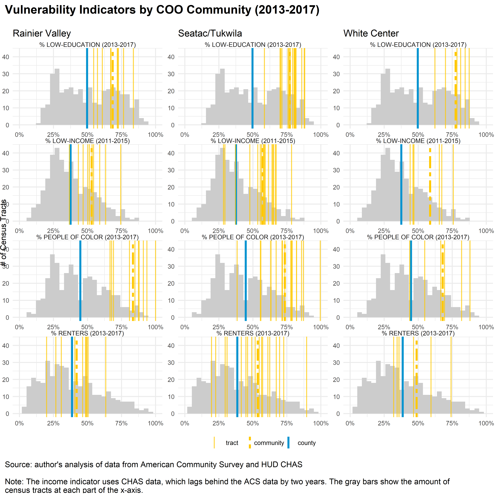

(\#fig:app-data-viz-comm-vuln-hist)Vulnerability Indicators by COO Community (2013-2017)

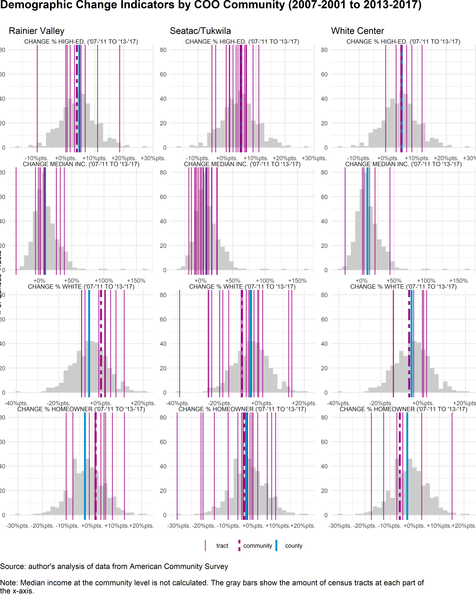

(\#fig:app-data-viz-comm-demo-hist)Demographic Change Indicators by COO Community (2007-2001 to 2013-2017)

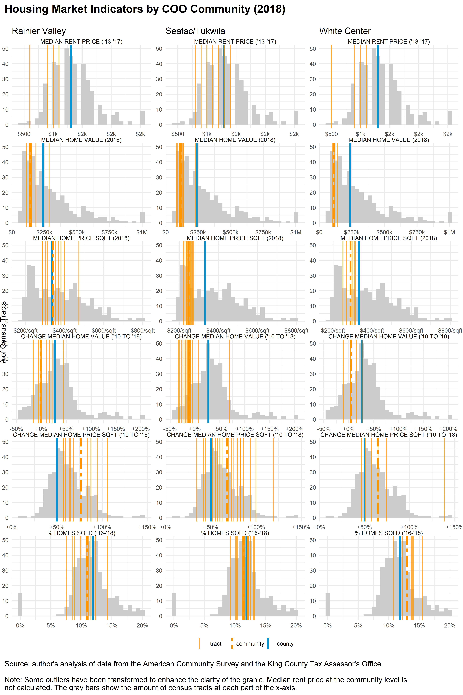

(\#fig:app-data-viz-comm-hous-hist)Housing Market Indicators by COO Community (2018)

## Other Data Visualizations {-}

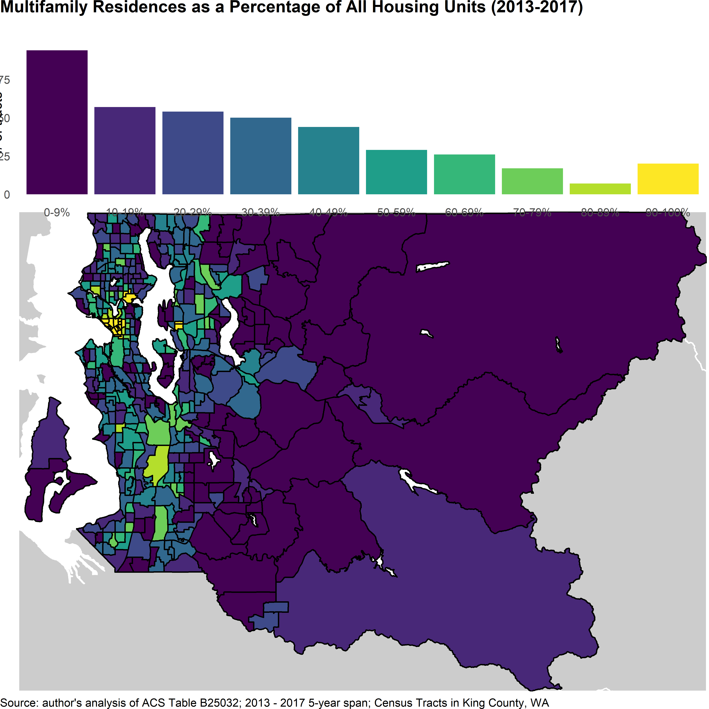

(\#fig:app-data-viz-pct-mf)Multifamily Residences as a % of All Housing Units (2013-2017)

<!--chapter:end:99-02-appendix-c-data-visualizations.Rmd-->

# Tabular Data

The following tables show the indicator values for the census tracts that are part of the three COO communities.

### Vulnernability & Demographic Change Indicators {-}

preserve56ffa9a77fe1115e

### Housing Market Change Indicators {-}
preserve2d90c35a3e51ceed

For the complete data set, please download the research compendium: https://doi.org/10.17605/OSF.IO/SJ7N9

<!--chapter:end:99-03-appendix-d-tabular-data.Rmd-->

# References {-}

<!--chapter:end:99-99-references.Rmd-->

