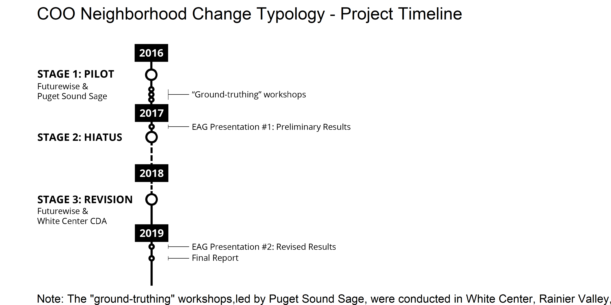
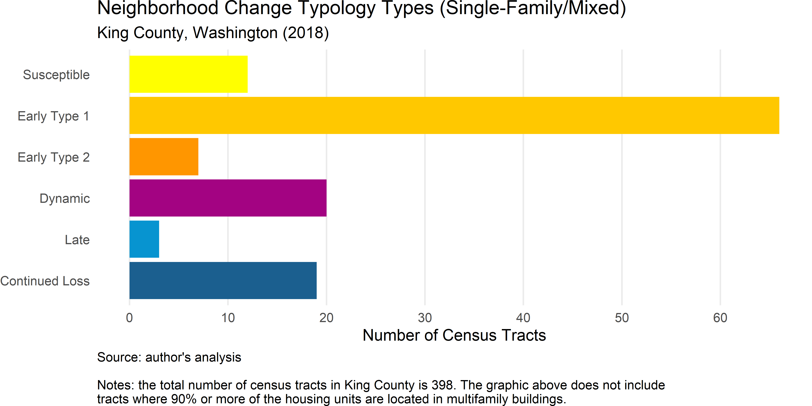
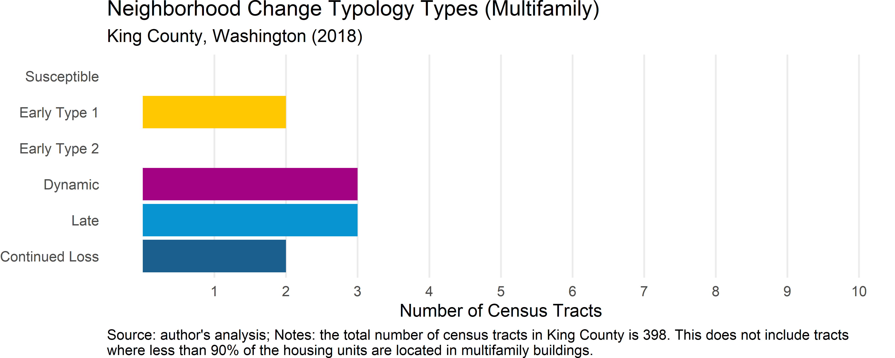
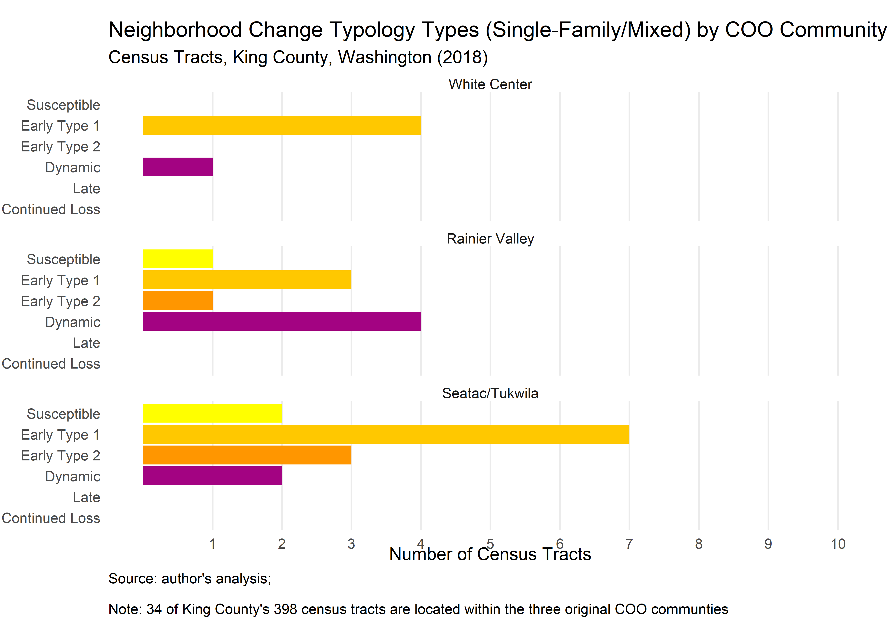
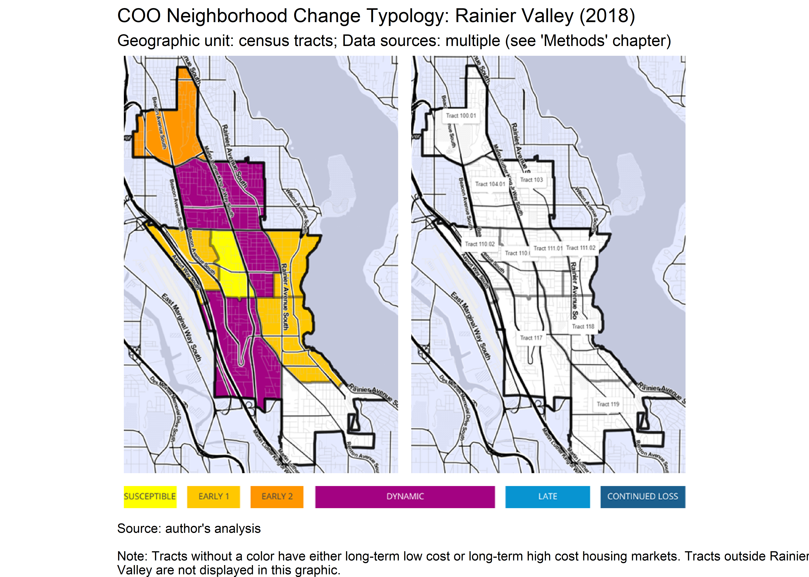
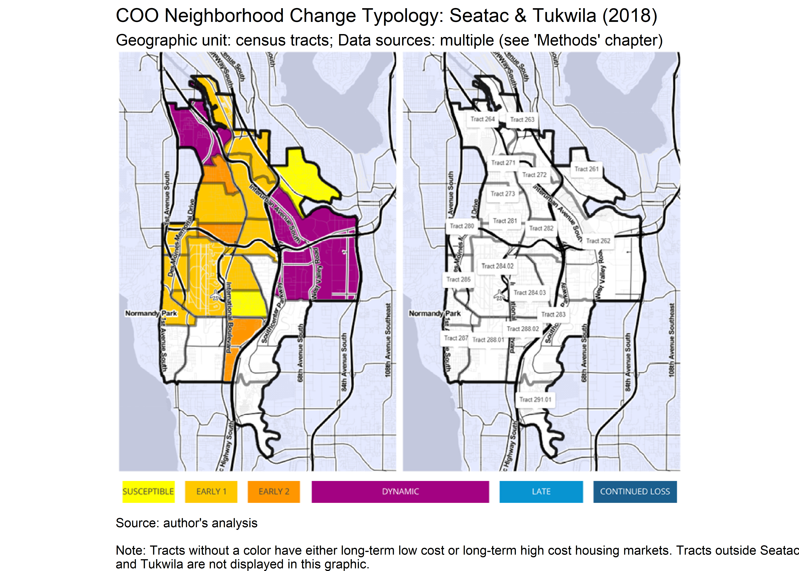
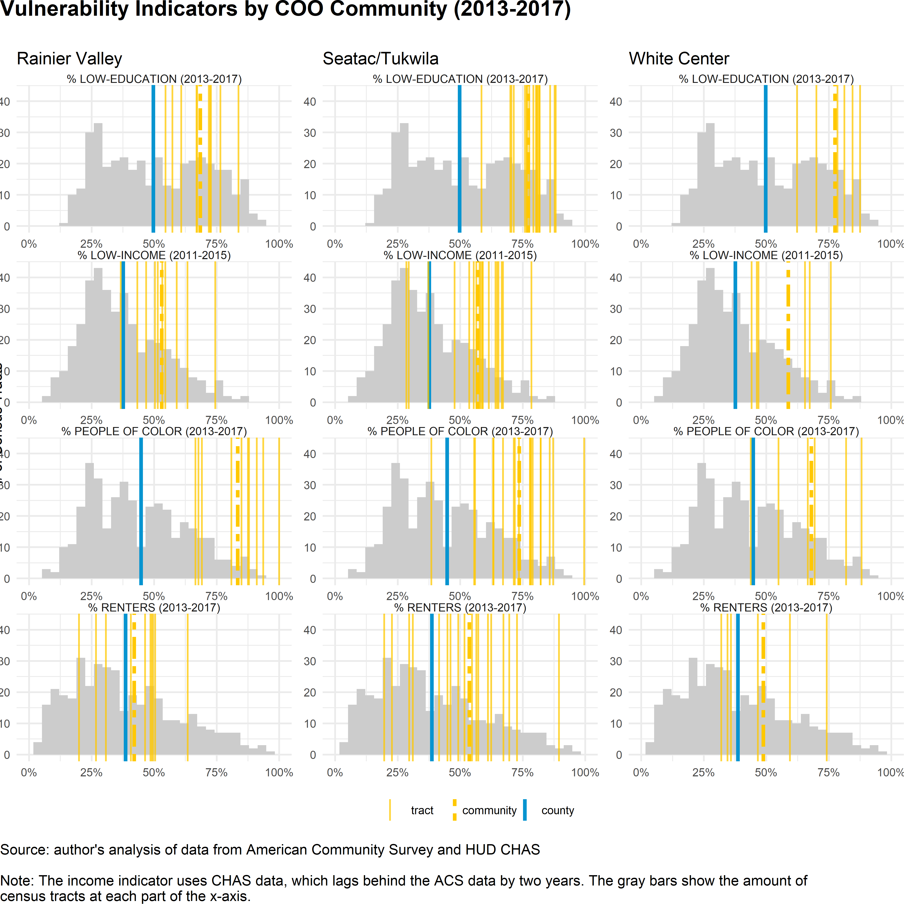

--- 
site: bookdown::bookdown_site
documentclass: book
bibliography: [book.bib, packages.bib]
biblio-style: apalike
csl: environment-and-planning.csl
link-citations: yes 
url: 'http\://tinyurl.com/NeighborhoodChangeTypology'
github-repo: tiernanmartin/NeighborhoodChangeTypology-bookdown
---

# {-}

 

 

# Acknowledgements {-}

Futurewise would like to thank King County Public Health and the Communities of Opportunity Program for their generous support, which made this analysis possible.

The authors would like to thank the staff members of the White Center Community Development Association for their valuable insights and critiques of the project throughout its timeline. They would also like to thank the following King County staff for their guidance and support: Andrea Akita, Public Health; Kim Tippens, Public Health; Kirsten Wysen, Public Health; Kristin Moore, Public Health; Cheryl Markham, Department of Community and Human Services; and Christie Most at the King County Assessor’s office.

Additional gratitude is extended to the members of the COO Evaluation and Advisory Group who provided feedback on the project and to all of the community members who contributed to the project by participating in workshops in the Fall of 2016. Without the guidance of community members and community-based organizations this project would not have been possible.
 

# Authors & Contributors {-}

#### [Futurewise](http://www.futurewise.org) {-}

Futurewise works to advance livable communities while protecting Washington’s most valuable natural resources. They collaborate strategically with legislators, government staff, community-based non-profits, Washington residents and Futurewise members to develop smart policy and advocate for responsible growth management. Futurewise works statewide with offices in Seattle and Spokane and a presence in both Pierce County and the Tri-Cities to create a livable and dynamic future for Washington.

Contributring staff include:

  - **Tiernan Martin**, author - for more information about the project contact Tiernan at tiernan@futurewise.org
  - **Yen Baynes**, author
  
#### [Puget Sound Sage](http://www.pugetsoundsage.org) {-}

Puget Sound Sage improves the lives of all families by building power for shared prosperity in the Puget Sound regional economy. 
They combine research, innovative policy and organizing to advance racial equity,stronger democracy, good jobs, affordable housing,
accessible transit and a healthy environment. 

Contributring staff include:

  - **Giulia Pasciuto**, contributor (Pilot Phase only)
  
#### [White Center Community Development Association](https://www.wccda.org/) {-}

The White Center CDA works to eradicate poverty and build a vibrant, economically diverse community.
They do this by:

  - Facilitating a community-driven agenda for change
  - Connecting families and community members to resources, services, and supports
  - Advocating for inclusion, engagement and resident leadership
  - Working across communities, cultures and systems
The WCCDA is committed to ensuring long-term equity and social justice through systems change for the benefit of the White Center community.

The White Center CDA made invaluable contributions to learning process and development of this research. The collaboration between Futurewise and WCCDA was instrumental in enabling the project team to unpack the limitations of research methods that fail to involve community members, as well as the importance of supporting communities in the struggle to control their own data. WCCDA provided crucial guidance to the project team’s search for indicators that better represent the experience of communities like White Center.

<!--chapter:end:index.Rmd-->

# Executive Summary {-}

## Background {-}

Gentrification and displacement shape the neighborhoods of King County, Washington’s cities and unincorporated urban communities in profound and complex ways. While many parts of America struggle to overcome depopulation and disinvestment, over the past two decades the residents of King County have experienced a set of challenges that come with growth: rising costs of living, ballooning commute times, and housing costs that have grown much faster than most incomes [@king_county_2016_2016]. Gentrification – a term that generally refers to the alteration of a neighborhood’s character in response to changes in the socioeconomic makeup of its residents, the appreciation of real estate values, and new investment by public and private actors – has occurred in many of King County’s neighborhoods during this period of regional growth. While the revitalization of neighborhoods that suffer the costs of persistent poverty is an outcome worth pursuing, it is necessary for policy makers to acknowledge that throughout history many such efforts have instead lead to the displacement of the residents and businesses from these neighborhoods. In King County and throughout the US, marginalized groups including communities of color and low-income communities have born a disproportionate amount of the pressures of urban growth, resulting in social fragmentation and diminished economic opportunity that have intergenerational consequences [@fullilove_root_2016].	

The project began in 2016 as an initiative of the Communities of Opportunity (COO) Evaluation and Advisory Data Workgroup (EAG), which had identified involuntary displacement as a critical but missing indicator of community opportunity. The project team started as a collaboration between Futurewise and Puget Sound Sage but later shifted to an intentional partnership between Futurewise and the White Center Community Development Association (WCCDA). All of the project’s partners made important contributions to the work but the insight and perspective of WCCDA were particularly instrumental in enabling the team to adapt the project’s indicators to more closely reflect the conditions on the ground.

The goal of this project is to provide a clearer understanding of which neighborhoods in King County are experiencing gentrification or are at risk of gentrifying, as well as a useful description of what stage each neighborhood is at in the process. The concept of a “neighborhood change typology” that is actionable and connects to anti-displacement policies comes directly from the work of Dr. @bates_gentrification_2013 [p.9]. Importantly (although perhaps counter-intuitively), this project does not try to measure the number of displaced households, nor does it try to predict displacement rates. While those two data points would be useful information and would fit nicely into the COO “headline indicator” framework, this project’s literature review suggests that there is not yet a methodologically sound way to measure them at the project’s geographic scale (i.e., all census tracts within King County). The project team intends for the typology information to be used by community-serving organizations in these neighborhoods as they organize their members to demand displacement mitigation and community restoration policies from the local government. 

In addition to presenting the project’s typology results, this report shares findings about the importance of conducting this work in a mutually accountable partnership between external partners (e.g., Futurewise) and community-based organizations (e.g., WCCDA). The value of including community members and trusted community-based organizations early in the process is explained in the report’s process findings section, as are the project team’s lessons learned about committing to equitable partnership practices and fixing mistakes in a project like this. These findings are included because of the project team’s commitment to transparency and so that future efforts might learn from this project’s mistakes.

## Guidance & Limitations {-}

The results of this project should be interpreted and used with caution. Academic researchers, corporations, and governments all have a history of using data analysis in ways that disempower marginalized communities, and it is important to the project team and to all participants in the Communities of Opportunity program that the findings of this project are not misused in this manner [@coalition_of_communities_of_color_leading_2018; @jolivette_research_2015; @townsend_cities_2015]. The following limitations should be considered when interpreting the project’s results and findings:

**The neighborhood types identified by this project do not represent the experience of everyone in each neighborhood.** 
They should not be used to undermine the validity of the lived experience of any individual or group. This project does not include the type of qualitative data that could reflect the experience of being displaced from a gentrifying neighborhood, nor does it provide a quantitative measure of displacement itself. 

**Data are not neutral; they reflect the systemic biases and power dynamics of the individuals or groups that produce them.** 
This project uses data that are publicly available for all neighborhoods in King County, but these data are published by public institutions that have their own priorities and mandates. Decisions about which data to collect and how the collection takes place reflect the priorities of public agencies like the US Census Bureau and the King County Tax Assessor’s Office, and it should not be assumed that their priorities always align with those of the communities most impacted by displacement.^[While lots of good social science research has been done using data from these sources, it is critical that researchers, community members, and policy makers understand and acknowledge the limitations of such data before using them to influence policy decisions] The absence of a frequently-updated, county-wide source of rent prices exemplifies the potentially misaligned priorities between the needs of groups that are susceptible to displacement and the priorities of public institutions.

**This approach uses a relatively small number of indicators to describe the stage of gentrification that neighborhoods are experiencing.**
The project team’s choice to use fewer indicators makes the results more scruitable but also limits the ability to identify different types of gentrification. It is important to understand that the results do not measure the amount of displacement that is occurring nor do they predict how much may occur. 

**This method does not include a way to add contextual data from the communities that are being displaced to refine its typology classification.**
Simply put, if a neighborhood is experiencing gentrification and displacement but those changes are not captured in US Census or Assessor’s Office data then this model will be wrong because it only “knows about” a small set of indicators. If used to inform public policy, the project’s results should complement the results of direct community engagement - not replace them.

**This project’s reliance on relative measures might discount the impact of absolute changes.**
While the median and quintile values provide a useful baseline for comparing the County’s tracts, this approach risks underestimating the impacts of region-wide growth. For instance, if most neighborhoods are experiencing rising housing costs while household incomes remain flat then residents will experience pressure to relocate. In this scenario the comparison of one neighborhood to the rest may be less important than the measurement of absolute change.

**Several technical limitations should also be considered when reading this report.**
For a project attempting to describe a localized, fast-moving process like gentrification, the following limitations are significant and important to acknowledge.

  - The use of survey data from samples of populations at the census tract scale introduces geographic abstraction and statistical uncertainty. Tracts are small, arbitrarily-defined units of geography that often don’t align with familiar neighborhood boundaries. Groups of people with disparate experiences may end up grouped together in the same tract, resulting in data that doesn’t reflect the actual experiences of most of the tract’s population. 
  - The use of statistical sampling increases the uncertainty of the results because this method relies on a relatively small number of survey responses to represent a whole tract. The uncertainty is reduced by combining survey results from different years (e.g., a five-year span of time like 2013 - 2017)
  - The results are more “outdated” and don’t fully reflect any recent changes that may have occurred. 

Given these limitations, the project team suggests that the the results be understood as an incomplete depiction of where and how gentrification is occurring in King County and that they should be used with appropriate caution. The team hopes that this project will be understood as imperfect attempt to simplify a complex socioeconomic process in order to identify appropriate public policy solutions that can be acted on quickly. **The results of this project should be interpreted not as definitive facts but rather as systematically-derived starting points for discussions between impacted communities and policymakers.** The findings should not be used as a substitute for direct engagement with impacted communities but they may help contextualize such efforts and point toward potential solutions.

## Process Findings {-}

  1. **The people from the communities most impacted by inequities are the ones who best understand the challenges that they face. They must, therefore, play a meaningful role in deciding what solutions to pursue.**  
  2. **Involving community members and staff from community serving institutions during the ground-truthing workshops played a critical role in the project team’s effort to identify representative indicators. Ground truthing earlier in the project would have made the process more efficient.**  
  3. **Equitable, well-resourced, and accountable partnerships between researchers/consultants and community-serving institutions/community members are necessary when conducting research that aims describe historically-marginalized communities.**  

## Typology Findings {-}

  1. **Over 30% of the County’s neighborhoods are either experiencing gentrification or are susceptible to it.**  
  2. **The vast majority of Communities of Opportunity (COO) neighborhoods show signs of gentrification but the specific stages of gentrification vary.**  
  3. **Each COO community has at least one neighborhood undergoing the “dynamic” stage of gentrification that is associated with ongoing involuntary displacement**  

 

<!--chapter:end:00-executive-summary.Rmd-->

# Introduction

## Project History

This project was undertaken at a time when King County was experiencing both economic and population growth.^[Between 1985 and 2015, King County's population grew by 25% (1.4M to 2.1M) and it is expected to grow to 2.3M by 2031 [@king_county_2016_2016]] As with any growing region, the costs and benefits of this growth have not been experienced equally or equitably by the County’s residents. The government of King County, in partnership with the Seattle Foundation, formed a partnership and began implementing the Communities of Opportunity (COO) program with the goal of “address[ing] economic and racial inequities through place-based work and systemic change”.^[To learn more information about COO visit the program's [website](https://www.coopartnerships.org/about-coo)]

Two of COO’s signature strategies (the practice data-driven policy making and the creation of peer-based learning communities) were exemplified by a group of placed-based organizations that met regularly to discuss the challenges and opportunities of working with community data. Known as the Evaluation and Advisory Data Workgroup (EAG)^[The name was initially just "The COO Data Workgroup" but it changed in 2018 to reflect the COO program's focus on internal evaluation], this body provided the inspiration and motivation for the project that would become the “COO Neighborhood Change Typology Report”. At a meeting in early 2016, EAG participants discussed the four outcome areas that COO had identified^[These include health, housing, economic opportunity, and community connections] and the “headline indicators” of these different topics. The group felt that progress was being made on the tracking of most indicators with one glaring exception: involuntary displacement. While everyone in the group had stories of neighbors and clients who were feeling displacement pressure (or had already moved because of it), the participants noted a lack of comprehensive data confirming these lived experiences. The group decided to explore how this problem might be addressed, a process which led to the formation of a subgroup and, ultimately, the creation of this report.

### Timeline {-}

### Stage One: Pilot Project, 2016 - 2017 {-}

Between the project’s start in 2016 and the publication of this report in early 2019, there have been several “stages” of work. The first might be described as the “Pilot Project” and it included many stages of its own: the formation of the project team; a review of gentrification and displacement literature; consultation with experts on demographic and real estate data; the development of a preliminary model and results; testing the veracity of these results by comparing them with community members’ lived experiences at “ground-truthing” workshops; and the periodic sharing of progress updates with the EAG.

The ground-truthing workshops, led by Puget Sound Sage, asked members of the three COO communities to describe their experiences of neighborhood change and compare them to the description provided by the Neighborhood Change Typology model.^[This was an earlier version of the model that used a different set of indicators from those used in the model presented in the Results section of this report.] The information shared by workshop participants strongly suggested that the model under-represented the degree of gentrification and potential displacement risk in the COO community neighborhoods, particularly in White Center.

The Pilot Project ended in January 2017 with a presentation to a group of COO stakeholders that included EAG members as well as members of the program’s system change committee and staff from some of COO’s place-based partner organizations. This presentation turned out to be a critically important milestone for the project. The results of the Neighborhood Change Typology method suggested that some parts of Seattle’s Rainier Valley neighborhood and the cities of Seatac and Tukwila^[These two cities were treated as a single place-based “community” in the COO program] were at-risk for gentrification (and displacement) and that the unincorporated community of White Center was not. These findings did not match the lived experience of many of the members of those three communities who had shared examples of on-going gentrification and displacement in the “ground-truthing” workshops. Inaccurate characterizations of communities can negatively impact marginalized communities by undermining their efforts to advocate for public resources and to hold policy makers accountable for addressing disparities. In the case of White Center, these inaccurate preliminary results also had the potential to be “weaponized” by opponents of affordable housing and other equitable community development efforts. Because of these implications, the project team requested additional time and funding to troubleshoot the model and gather data that better reflects the lived experiences of the community members through directly; this additional work was conducted in collaboration with the WCCDA.  

### Stage Two: Hiatus, 2017 - 2018 {-}

The next stage of the project was a 12-month period of no activity that stretched from March 2017 to March 2018. This gap in progress was largely due to the COO program’s internal reorganization work that occurred during this time period.

### Stage Three: Collaborative Revision, 2018 - 2019 {-}

In early summer of 2018, the project team reconvened and began working on a revision. Because the Pilot Project's preliminary results were most inaccurate and potentially damaging to the White Center neighborhood, the revision process focused on improving the model’s characterization of that community. Unfortunately, time and resource constraints prevented the team from expanding to include representatives from Rainier Valley, Seatac, and Tukwila, who could have provided important contextual information to guide the revision process.

Unlike the Pilot, the third stage was structured as a direct collaboration between Futurewise and the WCCDA to form the project team that would finalize the work. Futurewise took the lead on exploring alternative indicators that might improve the project’s model of neighborhood change and the WCCDA provided their expertise on the specific displacement-related challenges that the members of their community faced (and continue to face). The collaborative process involved many meetings in which the WCCDA staff offered invaluable input that guided the search for more-representative indicators. While higher-quality renter data was identified as a priority early in the process, it ultimately became clear that these data do not exist at the county-wide scale required by the project’s method. Nevertheless, the information that the WCCDA provided clarified the limitations inherent in both the original and revised method and led the team to emphasize these limitations in this report. Additionally, this partnership led to productive discussions between the two groups about the challenging limitations that are present in “institutional data” and how these limitations reflect the priorities of America’s dominant culture as reflected in local governments’ land use policies.

Unlike the Pilot phase, the revision did not include a series of ground-truthing workshops. While such workshops would have provided important feedback and vetting for the revised model, they were precluded by the project’s budgetary constraints. The revised Neighborhood Typology Results were presented to the COO EAG in February 2019, who suggested several improvements in how this project can be described to community members and made useful to community-based organizations. A consensus was reached that the neighborhood typology results by themselves provide an incomplete picture and that they must be complemented by contextual information that comes from the impacted communities themselves.

## Defining Gentrification & Displacement

Terms like "neighborhood change", "gentrification", and "displacement" have become increasingly commonplace in the popular discourse about American urban life but this doesn't mean that there is broad agreement on what they mean. To the contrary, the academic literature on this subject contains a passionate debate around the definitions of these words as well as the forces that cause them. This project benefits from the scholarship of researchers like Dr. Lisa Bates, who developed the method that this project is modeled after, and Dr. Miriam Zuk; who, along with her colleagues, produced a comprehensive literature review on these subjects [@bates_gentrification_2013; @miriam_zuk_gentrification_2015].

### Influential Works {-}

Rather than attempting to summarize the wide spectrum of research on these topics, this report highlights the specific pieces of literature that contributed most to the authors’ understanding of gentrification, displacement, and how the two relate. 

First and foremost, Dr. Bates’ 2013 report titled “Gentrification and Displacement Study: Implementing an Equitable Inclusive Development Strategy in the Context of Gentrification” provides an excellent overview of the scholarship before laying out a clear, reproducible method of “operationalizing” a "market-conscious" theory of gentrification. Bates’ work itself builds on a 2005 article by Dr. Lance Freeman which introduced a focused set of socioeconomic and real estate indicators to measure gentrification [@freeman_displacement_2005]. 

In addition to defining the “neighborhood change typology” model, Bates frames her analysis as a tool for selecting public policies that will promote equitable development rather than exacerbate displacement. She unpacks the public sector’s role in gentrification and prescribes the following steps to the City of Portland: adopt a “market-conscious” strategy involving the monitoring of housing market indicators; create regulations and incentives to “leverage limited housing resources”; and support community partner organizations as they build their capacity to lead anti-displacement efforts [@bates_gentrification_2013, pp.18-25].

In addition to Bates' and Freeman's respective works, the literature review by Dr. Miriam Zuk et al describes the scholarship landscape on neighborhood change, gentrification, and displacement. This work explains the different conceptions and helps dispel any notion that there might be a universally accepted method for measuring any of these phenomena. Dr. Lei Ding and Dr. Jackelyn Hwang’s study of homeowner mobility in Philadelphia, which uses anonymized credit data from the Federal Reserve Bank of Philadelphia, illustrates the extraordinary degree of methodological ingenuity and access to private data that is required to “track” displacement at the household level [@ding_effects_2018].

Lastly, the City of Seattle’s 2016 “Growth and Equity” report illustrates a different methodology applied to part of the study area of this report [@city_of_seattle_seattle_2016]. Although Seattle’s assessment of displacement risk is also informed by Dr. Bates’ work in Portland, it uses a wider variety of indicators to produce an estimate of the relative _amount_ of risk rather than  the relative _type_ of susceptibility (i.e., a “continuous” scale rather than a “discrete” one).

### Key Terms Defined {-}

While the authors acknowledge the existing debate around these terms, for the sake of clarity this project uses the following definitions when referring to each term:

  - **Neighborhood Change:** a substantial shift in the socioeconomic and/or racial composition of a neighborhood’s residents and businesses along with the elements of the built environment that make up the neighborhood’s physical space.
  - **Gentrification:** the socioeconomic “upgrading” of a neighborhood’s demographics combined with a shift from low to high real estate values. While gentrification in the US context is often associated with the racial turnover of majority people of color neighborhoods [@miriam_zuk_gentrification_2015, pp.7-9], this project does not limit its definition of gentrification to racial demographic change.^[While this project doesn’t _require_ evidence of racial turnover in order for a neighborhood to be considered “gentrifying”, this study shows that increases in white, non-hispanic population are common in King County's gentrifying census tracts. See the #methods section for a detailed explanation of how this project defines gentrification]
  - **Displacement:** “the involuntary relocation of current residents or businesses from their current residence” [@city_of_seattle_seattle_2016, p.4]. This may be caused by the physical destruction of a home, the process of becoming “priced out” of a neighborhood, or the loss of an individual’s community and community-serving institutions. While studies show that the causality between gentrification and displacement is less clear than the popular narrative would suggest [@ding_gentrification_2016, p.6], this project nevertheless follows Bates' example of treating displacement as a negative outcome resulting from the the process of neighborhood gentrification [@bates_gentrification_2013, pp.9-11].

Other terms used throughout this report include:

  - **Census Tract:** according to the US Census Bureau, census tracts are "small, relatively permanent statistical subdivisions of a county or county equivalent and generally have a population size between 1,200 and 8,000 people, with an optimum size of 4,000 people" [@us_census_bureau_geography_nodate]. For the purposes of this project, census tracts are used as a geographic proxy for neighborhoods.
  - **Indicator:** an indicator is the "representation of statistical data for a specified time, place or any other relevant characteristic, corrected for at least one dimension (usually size) so as to allow for meaningful comparisons... It is a summary measure related to a key issue or phenomenon and derived from a series of observed facts" [@eurostat_eurostat_nodate]. For example, this project uses the percentage of a census tract's population that are low-income as an indicator of vulnerability to displacement.
  - **Model:** according to Professor Daniel Kaplan of Macalester College, a model is "a representation for a particular purpose" [@kaplan_statistical_2009, p.6]. This project builds a "classification model" of neighborhood change in order to better understand what displacement mitigation and neighborhood revitalization policies to consider adopting in specific neighborhoods throughout King County. The project's model is grounded in a conceptual understanding of how neighborhood change works [see @freeman_displacement_2005; @bates_gentrification_2013; and @miriam_zuk_gentrification_2015] and model's results are determined by the indicator data.^[A common aphorism in the field of statistics says that "all models are wrong, but some are useful" [@box_science_1976]. This phrase means that models are _necessarily_ a simplification of reality and, therefore, they should be judged not by their accuracy alone but by their ability to represent a phenomenon with enough accuracy to be useful. While the project's authors generally agree with this observation, we also believe that researchers have a responsibility to ask themselves "to _whom_ is this model useful?" and to consider the history of harm that has been done to marginalized communities by researchers and their models.]

<!--chapter:end:01-introduction.Rmd-->

# Methods

## The Portland Model

This project begins with the method developed by Dr. Lisa Bates in partnership with the City of Portland, OR. As described by @bates_gentrification_2013 [p.59], 

> The typology assessment began with a retrospective look at neighborhood change in Portland to assess whether a small number of measured indicators could represent the changes observed today. … Measured indicators were chosen to represent the “robust, yet parsimonious” approach and to align with policy-relevant metrics (such as HUD income standards for housing assistance).

This approach uses the neighborhood (approximated by census tracts) as the unit of analysis, which was part of the reason it appealed to the project team.

Additionally, the method provides a clear conceptual structure for the process of neighborhood change. This structure is a three-level hierarchy^[While the project author characterizes Dr. Bates’ conceptual model as a hierarchy, Bates herself does not use that term in her report] and it enables Bates to develop definitions and assign “measured indicators” to them. 

The conceptual structure's levels are:

  1. **Statuses:** Long-term low cost/low income; at-risk or gentrifying; long-term high cost/high income
  2. **Stages (of neighborhood change):** Early-, Mid-, and Late-stage
  3. **Types (of neighborhood change):** Susceptible, Early Type 1, Early Type 2, Dynamic, Late, and Continued Loss

The diagram below illustrates how elements of this hierarchical conceptual structure relate to one another; it also pairs them with the results of Bates' 2013 assessment to demonstrate how this conceptual structure is reflected in the method's results:

(\#fig:methods-concept-diagram)Bates' Neighborhood Change Typology Conceptual model

### Statuses {-}

A neighborhood’s status simply describes whether or not it is considered to be at-risk for gentrification or not. Neighborhoods that experience long-term disinvestment and poverty face many challenges but the threat of gentrification only applies when these conditions are combined with a housing market that begins to rapidly appreciate in value.^[Bates explains that while long-term low-income and low-value neighborhoods are not likely to experience displacement pressure directly, they are connected to the gentrification process: “There is a relationship between gentrifying and low-income areas: the latter are the most likely destinations for low-income, vulnerable residents displaced from ‘hot’ markets.”  [-@bates_gentrification_2013, p.57]] Similarly, a long-term high cost neighborhood may experience home value appreciation but without a shift toward higher-income and highly-educated residents this case doesn’t fit the definition of gentrification. Further, as part of the Communities of Opportunity (COO) program this project is focused on supporting the County’s most marginalized communities and therefore addressing the potential gentrification of moderately high-value neighborhoods is not a priority for this effort. The characteristics of a gentrifying or gentrified neighborhood are “housing market changes, economic status changes, and demographic changes … that alter its character” [@bates_gentrification_2013, p.9].

### Stages {-}

The stages of gentrification provide high-level descriptions of the changes that are occurring in a neighborhood. Early-stage neighborhoods are at-risk or just beginning to show the signs of gentrification; Mid-stage neighborhoods are experiencing active gentrification pressures; and Late-stage neighborhoods have already progressed from low housing market value to high and have little or none of the previous community left.

Bates connects each stage to a set of public policies and strategies that communities can advocate for. This connection between the conceptual model and potential solutions is significant strength of Dr. Bates’ method.

### Types {-}

The six types in the Neighborhood Change Typology represent the full spectrum of possibilities for at-risk and gentrifying neighborhoods. While a given neighborhood could (in theory) progress through all six stages linearly, the typology does presume that to be the case; change happens at different rates and in different “flavors” in different neighborhoods. 

### Dimensions of Neighborhood Change {-}

The characteristics of a neighborhood that determine its type are referred to as the "dimensions". In Dr. Bates' method, the dimensions of neighborhood change include:

  1. **Vulnerability to Housing Displacement:** whether the neighborhoods residents have relatively high percentages of groups that have historically been less able to resist displacement pressure. These groups include: 
      a. Adults with low levels of education (less than a Bachelor's degree)
      b. People of color^[Throughout US history, racist actions taken by governments, businesses, and individuals have forced people who aren’t white to live in certain neighborhoods. Examples of these types of actions - including the redlining of communities of color, the placement of racially restrictive covenants on property deeds, and the physical degradation (or destruction) of people of color neighborhoods in pursuit of public infrastructure projects - are present in the history of many places in King County and elsewhere [see @taylor_forging_1994; @chin_seattles_2001]. While a person’s race or ethnicity should not (in theory) make them any more or less vulnerable to displacement, the legacy of systemic racism has significant, inter-generational negative influence on the lives of people of color [@chetty_race_2018] and therefore this project treats race as an indicator of vulnerability to displacement.] 
      c. Low-income households
      d. Renter households
  
  2. **Demographic Changes:** whether there is a relatively large change in multiple demographic groups. These are the groups that have historically been more able to resist displacement pressure and more likely to participate in neighborhood change as gentrifiers. They include:
      a. White people
      b. Adults with more formal education (a Bachelor's degree or higher)
      c. Medium/high-income households
      d. Owner households
      
  3. **Housing Market Appreciation:** whether the neighborhood's housing market is shifting from a low-value state to a high-value one. Bates measures this change using the home values themselves (in comparison to all neighborhoods) and the rate of change in these values (i.e., appreciation) [-@bates_gentrification_2013, p.28]. The Housing Market Appreciation dimension of neighborhood change can itself be divided into types:
      a. **Adjacent neighborhoods:** low/moderate value neighborhoods with low appreciation rates that are next to high value or rapidly appreciating neighborhoods^[The Adjacent type is intended to capture the "spillover effect" where the proximity to high value markets draws buyers to a nearby low value neighborhood [see @bates_gentrification_2013, p.61]]
      b. **Accelerating neighborhoods:** low/moderate value neighborhoods with high appreciation rates
      c. **Appreciated neighborhoods:** high value neighborhoods that appreciated from low value status over a longer period of time

## The (Revised) Communities of Opportunity Model

The model that Dr. Bates developed for the City of Portland served as a foundation for this project and for many others.^[see @city_of_seattle_seattle_2016] However, given that this approach uses a limited number of indicators to capture a complex process, it is necessary to adapt the method slightly to fit the context in which it is applied.^[When developing the model for Portland, Dr. Bates began with a “retrospective look” at neighborhood change in that city and this process informed the selection of indicators; see @bates_gentrification_2013 [p.59]] After considering the context of King County and receiving constructive criticism of the preliminary model, the project team decided to implement the following adaptations to the Portland model:

  1. **Use the most recent data available**
  2. **Add indicators of housing market appreciation** that might capture faster rates of change
  3. Where possible, **make a distinction between the experience of renter and homeowner households** (note: this goal was not fully achieved)
  
### Most Recent Data {-}

The Portland model uses data from the two sources: the US Census and the Department of Housing and Urban Development (HUD) Comprehensive Housing Affordability Strategy (CHAS).^[The sources of the US Census data used in the Portland model include both the American Community Survey and the Decennial Census] The vulnerability indicators used the most recent 5-year spans while the indicators of demographic change and housing market appreciation used decadal samples.

In contrast, the COO Revised Model uses data from one additional data source (the King County Tax Assessor’s Office) and uses the most recent data from that source as well as the US Census. For example, instead of comparing the change in the percentage of white households between 2000 and 2010, the model compares the two most-recent (non-overlapping) 5-year spans: 2007-2011 and 2013-2017.^[Note: the 2008-2012 5-year span could have been used but the project team decided not to because the potential increase in recency didn’t outweigh the cost of revising the data processing code. This change could be made to future improvements of the model.] The indicators that rely on data from the tax assessor use shorter, more recent time periods than the Census-based indicators. 

### Appreciation Indicators {-}

While the Portland model relied on US Census surveys responses, the COO Revised model primarily uses data from the King County Tax Assessor. The tax assessor data captures the entirety of the County’s housing properties and the valuations are updated regularly according to the  County’s algorithm. Additionally, this data includes all sales of housing properties along with relevant metadata like the sale price, the size of the home, and the “instrument” of the sale (e.g., foreclosure, divorce settlement, etc.).^[See the metadata for the ‘Real Property Sales’ file listed on King County’s Assessor Data Portal: <https://info.kingcounty.gov/assessor/datadownload/desc/Real%20Property%20Sales.doc>]

In addition to adding a source of more recent housing market data, this project deviates from the Portland model by using multiple indicators in the definition of each housing market appreciation type. For instance, a neighborhood with a “High” 2018 value may either have a high median assessed value or a high median sale price per square foot (both measures are relative to all census tracts in King County). Similarly, this project adds a measurement of the percentage of homes sold in a neighborhood in the past three years as an alternate indicator of a “hot” market. The inspiration for this additional appreciation indicator comes from Bates’ recommendations for the “monitoring and tracking” of new market sales activity [-@bates_gentrification_2013, p.35]. The COO Revised Model refers to this sale rate indicator as “short-term” appreciation and the home value indicator as “medium-term” appreciation, but the presence of a high value in either indicator is interpreted by the model as an “appreciating” housing market type.

### The Renter Experience {-}

The Portland model includes housing tenure (i.e., whether a household owns or rents their home) in the Vulnerability and Demographic Change dimensions of neighborhood change. However, its Housing Market Appreciation dimension does not include rent prices. Home rent prices are challenging data to obtain both because there is no requirement that landlords publicly disclose rent prices and because these prices change dynamically in response to the local housing market. An argument could be made that rent prices are loosely correlated with the values of owner-occupied homes, so using only the latter data will still capture most of the housing market conditions for a given neighborhood. 

Nevertheless, this project made an effort to include rent prices in the Housing Market Appreciation dimension of neighborhood change. This decision was made after receiving feedback during all three of the “ground-truthing” workshops and from the project’s partners at the White Center Community Development Association that rent prices in this region are growing at a rate that leaves many working class and low income households with no choice but to move away from their neighborhoods. 

The project team tried to identify a reliable source of rental prices for King County but was unsuccessful in this effort.^[Similar projects like @city_of_seattle_seattle_2016 used data from the now-closed market research firm Dupre and Scott. Other data sources that are currently available do not provide data at the census tract geographic scale.] Instead, data from the American Community Survey 5-year spans was included in the model even though it does not meet the projects requirements for “freshness” (i.e., rents change too dynamically to use a sample of survey responses collected over the span of five years).

Finally, this model makes a distinction between neighborhoods that are predominantly multifamily housing markets and those that are either mostly single family or mixed housing markets. The primary reason for this change is that several of King County’s census tracts are almost entirely composed of multifamily homes and therefore the use of median single family home values as an indicator of market appreciation would yield inaccurate results.^[A simple analysis of the share of housing units in multifamily buildings (by census tract) led the project team to select >=90% as the threshold for determining that a tract should be considered “mostly multifamily”. See Figure \@ref(fig:app-data-viz-pct-mf) for details.] Instead, the COO Revised model uses a combination of rent prices, residential condominium values, and sale prices for these neighborhoods. This allows the model to more accurately describe the stage of gentrification for neighborhoods located near central business districts (primarily Seattle’s CBD) while avoiding the inadvertent "erasure" of the experience of these neighborhoods' residents.

## Model Comparison

The following table captures the similarities and difference between the Portland model and this project's adaptation of it. The primary distinctions between the COO Revised model and the Portland model are the use of more recent data, the addition of alternative indicators of housing market appreciation, and the division of the model between neighborhoods with mostly multifamily housing and those characterized by either mostly single family or a mixture of housing types.

preserve90faa092cbaebe33

## Reproducibility & Open Source Materials

The raw data and an R package containing the project's code files are available to download at 
https://doi.org/10.17605/OSF.IO/SJ7N9

<!--chapter:end:02-methods.Rmd-->

# Results

## COO Revised Model (Single-Family/Mixed) Results

The COO Revised Model identifies many neighborhoods in King County as either “at-risk” or gentrifying. While the results below have not been vetted by every community in the county, the project team believes that these results can nevertheless be useful in framing discussions about anti-displacement and community stabilization policies if used responsibly. As was previously mentioned, it is imperative that Neighborhood Change Typology results be paired with local contextual data from impacted communities in order to determine their accuracy and utility.

(\#fig:findings-type-counts)The number of tracts in each typology type

Of the 398 census tracts in King County, just over 30% of them show signs of either being vulnerable to gentrification or experiencing this process right now (or in the recent past). Geographically, these neighborhoods are predominantly concentrated in southwestern part of the county with a few notable exceptions. 

(\#fig:findings-kc-map)COO Neighborhood Change Typology - Single-Family/Mixed (2018)

Of the 127 neighborhoods identified as being "at-risk" or gentrifying, the majority (67%) fall in the Early stage of gentrification (Susceptible, Early Type 1, or Early Type 2), while 16% are classified as Mid-stage (Dynamic) and 17% are Late-stage (Late or Continued Loss). 

Geographically, these neighborhoods appears to be split into three clusters: 

  1. **Southwestern King County:** most of the tracts in this area are either Early- or Mid-stage
  2. **East of Lake Washington:** the vast majority of these tracts are in the Late stage
  3. **North Seattle, Shoreline, and Bothell:** tracts in this cluster span all three stages of gentrification from Early to Late

## COO Revised Model (Multifamily) Results

There are far fewer neighborhoods included in the “mostly multifamily” model results. This is because most neighborhoods in King County have a mixture of single-family and multifamily homes, making it relatively rare to find one where over 90% of the homes are located in multifamily buildings.^[As previously mentioned in the [Results](#results) section, the 90% threshold is an arbitrary one but it was arrived at through an analysis of the data. See Figure \@ref(fig:app-data-viz-pct-mf) for detail of that analysis.]

The tracts included in the multifamily version of the COO Revised Model are geographically concentrated in Seattle and they include all three stages of gentrification (Early, Mid, and Late). However, as the figure below demonstrates, only four of the six types of neighborhood change are identified in the "mostly multifamily" neighborhoods.

(\#fig:findings-type-counts-mf)The number of tracts in each typology type (multifamily)

The neighborhoods are located either within Seattle's "city center" area (broadly defined) or within the University District.^[The “city center” is, in this case, being defined here to include the range of neighborhoods from Chinatown International District in the south to South Lake Union in the north; it also includes the westernmost part of Capitol Hill]

(\#fig:findings-kc-map-mf)COO Neighborhood Change Typology - Multifamily (2018)

## COO Revised Model Results By Community

The COO program’s three original place-based communities are White Center, Rainier Valley, and the combined residents of Seatac and Tukwila. These three communities include approximately 167,000 residents from four separate jurisdictions and countless distinct racial, ethnic, and cultural communities.^[Using data from the 2013-2017 American Community Survey, the author's calculations show the population of the census tracts included in the three original COO place-based communities to be 166,967 (+/-2,698) people]

The model identifies 28 of the 34 census tracts in these three communities as being either “at-risk” or gentrifying. Half of those 28 tracts fall into the Early Type 1 type while another quarter are identified as Dynamic (Mid-stage gentrification). Unlike the county as a whole, no Late-stage gentrification tracts are identified within the three original COO communities.

(\#fig:findings-type-by-comm-counts)The number of tracts in each typology type by COO Community

As indicated in the graphic below, no clear pattern is present in the geographic distribution of the neighborhood change types.

(\#fig:findings-typo-coo-comms-map)COO Neighborhood Change Typology - Original Three COO Communities (2018)

The following maps display the COO Revised Neighborhood Change Typology (2018) results for the original three place-based communities.

### COO Revised Model Results: White Center {-}

(\#fig:findings-wc-map)COO Neighborhood Change Typology: White Center (2018)

### COO Revised Model Results: Rainier Valley {-}

(\#fig:findings-rv-map)COO Neighborhood Change Typology: Rainier Valley (2018)

### COO Revised Model Results: Seatac & Tukwila {-}

(\#fig:findings-stk-map)COO Neighborhood Change Typology: Seatac/Tukwila (2018)

<!--chapter:end:03-results.Rmd-->

# Discussion

## Partnership & Process Findings

Before discussing the project’s results (and their policy implications), it may be beneficial to consider the partnership and process that made the results possible.

Data-driven analyses like this one have no shortage of technical challenges to overcome but perhaps an even greater obstacle is the formation of the type of partnership that brings together the necessary expertise to complete the project responsibly. This project benefited from its genesis in the COO Evaluation and Advisory group, where staff members of community-based organizations helped to shape it with their knowledge of the three COO communities. Even though the project team had access to this pool of local expertise, the Pilot phase’s preliminary results did not reflect the lived reality of many of these communities. Through collaboration with the WCCDA in the revision stage, the project team was able to explore the inaccuracies of these findings and brainstorm solutions for gathering data that would better reflect the lived experiences of the communities. Although the method and data remain subject to many limitations, the project team is confident that the collaborative process enhanced the accuracy of the final results.

This experience underscores what might be the most significant finding of the project:
 

#### 1. The people from the communities most impacted by inequities are the ones who best understand the challenges that they face. They must, therefore, play a meaningful role in deciding what solutions to pursue. {-}

A classification model built with institutional data can be useful, but its utility depends on the participation of members of the communities that are experiencing gentrification and displacement. Advisory groups, “ground-truthing” workshops, and flexibility on the part of the project team are all necessary components of a project like this one.

This project’s method relies on a small group of people using data from public institutions to produce information about many neighborhoods. The experience of undertaking this project has led its team to conclude that there is significant value in pursuing other research methods; ones that center the members of the most impacted communities and invest in their exploration of the issues that matter most to them. The approach known as “research justice” offers great potential in the pursuit of equitable community development and other related goals held by the Communities of Opportunity program and the government of King County.
^[For more information about research justice, see @jolivette_research_2015 and @coalition_of_communities_of_color_leading_2018]

#### 2. Involving community members and staff from community serving institutions during the ground-truthing workshops played a critical role in the project team’s effort to identify representative indicators. Ground truthing earlier in the project would have made the process more efficient. {-}

Initially, the question of whether to include ground-truthing workshops in the Pilot Project or to recommend them as next steps was a source of disagreement within the project team. After some back-and-forth debate, Puget Sound Sage prevailed with their argument that local contextual information is crucial not only for the research’s accuracy but also as a safeguard to prevent unintended harm to marginalized communities. This decision proved to be the right one, as these workshops provided feedback and criticism that significantly influenced the revision process and the project’s findings. Had there been efforts to engage directly with residents of the COO communities (aside from the EAG participants) earlier in the process, it is possible that a more accurate set of indicators would have been selected during the pilot and that the revision phase might not have been necessary. In any case, this project clearly benefited from the direct feedback of community members and the project team strongly recommends that other related projects apply this approach as well.

#### 3. Equitable, well-resourced, and accountable partnerships between researchers/consultants and community-serving institutions/community members are necessary when conducting research that aims describe historically-marginalized communities. {-}

Given the major takeaway learned during Pilot stage, it became clear to Futurewise that they would need to partner and build stronger relationships with at least one of the communities that are experiencing gentrification. Since the WCCDA had expressed interest in offering more in-depth feedback, they became a natural ally in the search for better data sets to reflect their community. In October of 2017, Futurewise used its own resources to offer a graduate fellowship to Yen Baynes, a POC White Center community organizer and researcher.  This fellowship allowed Futurewise to build a closer relationship with the WCCDA because Ms. Baynes’ graduate thesis focused on her work with a WCCDA’s youth internship. Ms. Baynes joined the Neighborhood Change Typology (NCT) project in June of 2018, where she worked closely with Futurewise’s Data Analyst, Tiernan Martin, and WCCDA’s Data and Evaluation Manager, Dao Tran, to fine-tune the NCT by coordinating meetings in which both Futurewise and WCCDA staff worked together to identify indicators and data sets.

As a result, Futurewise was able to gain the insight necessary to complete the project.  There were many lessons learned throughout about how primarily White-led, issue-focused organizations such as Futurewise can work with POC-led, community-based organizations like the WCCDA.  One major lesson came near the end of this project as the WCCDA held Futurewise accountable by insisting that this report be written more collaboratively after a less-complete report was turned in without input from the WCCDA or Puget Sound Sage. The accountability required to form a more collaborative approach was reinforced by the equitable relationships that had been built throughout the project.  As a result, Futurewise learned the critical importance of operationalizing accountability to community members moving forward.

## Typology Findings

#### 1. Over 30% of the County’s neighborhoods are either experiencing gentrification or are susceptible to it. {-}

According to the project’s definition of “gentrification”, this means that a substantial portion of the County is experiencing an upward shift in socioeconomic demographics combined with housing market appreciation. Gentrification occurs in changing neighborhoods that are neither persistently low-income/low-value nor persistently high-income/high-value; in and of itself, it is not necessarily a bad thing.  

**However, history suggests that without community mobilization and strategic intervention by local governments, many community members in these changing neighborhoods will be forced to relocate just as the benefits of revitalization begin to emerge.**

The identification of 127 census tracts that meet the criteria for being at-risk or gentrifying suggests that substantial investment in anti-displacement and neighborhood revitalization initiatives should be undertaken. The large concentration of Early- and Mid-stage neighborhoods in the southwestern part of the county reaffirms what many of the “ground-truthing” workshop participants said: individuals, families, and whole communities are being “pushed“ out of Seattle’s South End neighborhoods and this shift seems to be rippling through the communities to the south. A similar effect may be occurring in some of Seattle’s North End neighborhoods near the city’s border with Shoreline, although the model suggests that a few of these communities are already in the Continued Loss stage of neighborhood change. 

Seattle’s Central Area neighborhood (also known as the Central District) shows a combination of Late and Continued Loss types - a result that reflects only the most recent part of the decades-long displacement of Seattle’s original African American community [@taylor_forging_1994; @mcgee_seattles_2007].

Lastly, the geographically dispersed group of Continued Loss type neighborhoods east of Lake Washington is unexpected and warrants further investigation.

#### 2. The vast majority of COO neighborhoods show some signs (at least) of gentrification. {-}

Of the COO neighborhoods, the most prevalent type is Early Type 1. This indicates that a neighborhood has relatively large populations that are vulnerable to displacement; has not yet seen a substantial demographic shift toward whiter, more affluent, better educated home owners; and still has low or moderate home values but is seeing high rates of short-term or medium-term home value appreciation. Put plainly, the neighborhoods are “on track” to gentrify and may soon experience significant displacement pressure (if they aren’t already).

The introduction of the additional indicators of appreciation (i.e., change in sale price per square foot and the percent of homes sold) improves the model’s ability to identify housing markets with high turnover rates.^[see Figure \@ref(fig:app-data-viz-comm-hous-hist) for a comparison of housing market indicators by COO community] The large number of Early Type 1 neighborhoods suggests that many places with high concentrations of vulnerable people are also the places where the housing market is “heating up”. This methodological change accounts for much of the different between the preliminary results produced during the Pilot phase and the final model results.

#### 3. Each COO community has at least one neighborhood undergoing the type of active gentrification associated with involuntary displacement. {-}

While evidence of substantial demographic change is present in only 7 of the 34 COO community tracts, each of the communities has at least one such changing tract. As with the Early Type 1 neighborhoods, the new housing market appreciation indicators help the model to better identify Dynamic neighborhoods. While the demographic change indicators cannot by themselves be used as measures of displacement, they strongly suggest that vulnerable groups are being displaced from these neighborhoods. The Rainier Valley, which has four Dynamic tracts, should be treated as a community undergoing active gentrification and policies that are appropriate to this gentrification stage should be explored by community members and policy makers.

## Policy Implications

The goal of this project is to provide a consistent description of gentrification so that community leaders and policy makers can design effective intervention strategies that address and mitigate the displacement risk that marginalized communities face as King County continues to grow rapidly. The project adopts Dr. Bates’ neighborhood change typology framework (with modifications) and it also includes her “Policy Toolkit” to guide discussions about which tools and strategies might best address the needs of marginalized residents in COO communities. As Bates states, the decisions about which tools to use and how to prioritize scarce public resources are inherently political and therefore must be made in partnership with the most impacted communities @bates_gentrification_2013 [p.56]. Additionally, one of the lessons learned as a result of this project is that equitable, well-resourced, and accountable partnerships with community-serving institutions are critical ingredients to success. The project team wishes to emphasize that this lesson applies both to research and to efforts to design or implement policies on a community’s behalf. Anti-displacement and community-stabilization policies that are generated by members of marginalized communities will have a much higher likelihood of sustained success than those that are created by external partners alone.

Prescriptive policy recommendations for specific communities are beyond the scope of this project but Dr. Bates’ “Policy Toolkit”, when paired with the typology results, may be useful in partnering with communities to assess appropriate policy alternatives. See [Appendix A: Bates' Policy Toolkit](#bates-policy-toolkit) for a list of the specific policies that Bates recommends for each stage of gentrification.

#### Final word on inclusive policy-making {-}

The importance of including people from the communities experiencing the disruptive impacts of displacement bears repeating. During the course of this project, the authors have witnessed first-hand how valuable and necessary it is to have local expertise “at the table“ when making these sort of decisions. The COO program is designed to embody this approach, as exemplified in their six strategies:

>  * Establishing community-based priorities
>  * Tapping into existing community expertise and leadership
>  * Strengthening community capacity for advocacy and to take on local challenges
>  * Systematizing a collaborative approach between communities and institutions
>  * Shaping policies to promote equity and positively impact our communities
>  * Bringing new resources into communities ^[For more details on the COO's approach see @noauthor_communities_nodate]

As mentioned in the [Guidance & Limitations section](#guidance-limitations) of the [Executive Summary](#executive-summary), if the results of this project are used to inform public policy, it is critical that they _complement_ the findings of direct community engagement - not replace them.

<!--chapter:end:04-discussion.Rmd-->

# Conclusion

The disruptive threat of displacement is confronted by communities throughout King County. The Communities of Opportunity program provides a framework for the formation of public/private/community-based relationships that are uniquely capable of confronting systemic challenges like gentrification and involuntary displacement.

In 2016, a working group of community-based organizations from White Center, Rainier Valley, Seatac, and Tukwila decided to prioritize the monitoring of involuntary displacement in their neighborhoods. This led to a three-year endeavor with plenty of challenges along the way but ultimately the project arrived at its stated goal: a data-driven typology of neighborhood change that can inform current and future anti-displacement work.

The method, based on the work of Dr. Lisa Bates in Portland, OR; categorizes neighborhoods according to their gentrification stage (Early-, Mid-, and Late-stage) and the specific type of neighborhood change that they reflect. In 2016 the project team developed a preliminary model but it failed to identify the type of gentrification that was occurring in communities like White Center. The project began again in 2018, this time with a partnership between the initial project team (led by Futurewise) and the White Center Community Development Association. Together, the partnership developed a revised version of the neighborhood change typology that incorporates new indicators of housing market change.

The results of the project suggest that over 30% of the neighborhoods in the cities and unincorporated communities of King County are experiencing some stage of gentrification. Within the COO communities, the vast majority of neighborhoods are in either the Early- or Mid-stages; a result that reaffirms the many of the community members concerns and suggests some specific tools and strategies that should be investigated by community members and policymakers. The project also demonstrates the inherent limitations of data-driven methods that rely solely on datasets produced by centralized public institutions: they often exclude or mischaracterize the communities that are most marginalized. The lack of recent, county-wide rent price data is an example of how data availability reflects the power dynamics of a society, posing a challenge to this project and others like it.

While the findings of this project are limited by the method that produced them, there are clear applications of this knowledge in the development of anti-displacement and neighborhood revitalization strategies. The project team hopes that this information can serve as a foundation for subsequent projects and collaborations; preferably ones that experiment with different approaches that might better advance the opportunity of communities throughout King County.  Some of the same literature that informed this work also calls for providing communities, especially marginalized communities that include low income people and people of color, the wherewithal and the access to create, analyze and utilize their own data to inform policy decisions [@jolivette_research_2015]. Indeed, the project team found that throughout the process, it was the perspectives of community members that provided the most insight into how to improve the research. The project team suggests that when assessing next steps for researching and understanding gentrification and displacement in King County, the COO program should consider investing in educational and methodological resources for communities to embark on social science research that can yield community generated data. This would provide a critical missing link for better assessing policy solutions that seek to curb the negative impact of gentrification on these communities.

<!--chapter:end:05-conclusion.Rmd-->

# (APPENDIX) Appendix {-}

# Bates' Policy Toolkit

Please note that the following tables are direct transcriptions from @bates_gentrification_2013:

#### 1. Plan for inclusive, equitable development {-}
preserve7f2608b0c2a551c1

#### 2. Increase/preserve opportunities for affordable housing {-}
##### 2.1 Generate revenue for housing programs {-}
preserved55d81420bb4f74c

##### 2.2 Create new affordable housing {-}
preserve9bb140e3f5dc729c

##### 2.3 Preserve affordable housing {-}
preservecbec13285cf2ac44

<!--chapter:end:99-01-appendix-a-policy-toolkit.Rmd-->

# Interactive Maps

## COO Revised Neighborhood Typology {-}

The following interactive map includes the model results for both housing market types (Multifamily and Single-Family/Mixed).

_Tip: click the map to see to see the census tract identification number_

preservec886b45dd5767ae9

<!--chapter:end:99-01-appendix-b-interactive-maps.Rmd-->

# Data Visualizations

## Project Indicators by COO Community {-}

### How to Read these Plots {-}

The following plots display a large amount of data in a visually-dense format. The indicators for each COO Community are arranged in a column; within those columns, each grid square contains the following information:

  * the indicator values for each census tract (represented by a thin yellow line)
  * the indicator values for all census tracts (represented by a light gray histogram chart in the grid's background)
  * the indicator value for King County (represented by a thick blue line)
  * _for percent indicators only:_ the indicator value of all of the tracts in the COO community combined (represented by a thick dashed yellow line)
  
Reading the plot from top to bottom, one column at a time, the viewer can see how the tracts of each community compare to each other; to the community as a whole; to the county as a whole; and to the distribution of values amongst all King County census tracts.

### Plots {-}

(\#fig:app-data-viz-comm-vuln-hist)Vulnerability Indicators by COO Community (2013-2017)

(\#fig:app-data-viz-comm-demo-hist)Demographic Change Indicators by COO Community (2007-2001 to 2013-2017)

(\#fig:app-data-viz-comm-hous-hist)Housing Market Indicators by COO Community (2018)

## Other Data Visualizations {-}

(\#fig:app-data-viz-pct-mf)Multifamily Residences as a % of All Housing Units (2013-2017)

<!--chapter:end:99-02-appendix-c-data-visualizations.Rmd-->

# Tabular Data

The following tables show the indicator values for the census tracts that are part of the three COO communities.

### Vulnernability & Demographic Change Indicators {-}

preserve9cf26301f8e8f9a9

### Housing Market Change Indicators {-}
preservef8fbc7d5a764c042

For the complete data set, please download the research compendium: https://doi.org/10.17605/OSF.IO/SJ7N9

<!--chapter:end:99-03-appendix-d-tabular-data.Rmd-->

# References {-}

<!--chapter:end:99-99-references.Rmd-->

