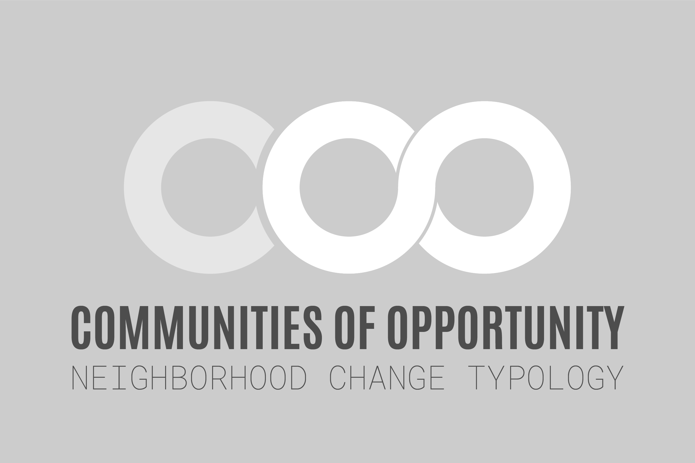

--- 
site: bookdown::bookdown_site
output: 
  bookdown::gitbook:
    css: style.css
documentclass: book
bibliography: [book.bib, packages.bib]
biblio-style: apalike
link-citations: yes
monofont: "Source Code Pro"
monofontoptions: "Scale=0.7"
url: 'http\://tinyurl.com/NeighborhoodChangeTypology'
github-repo: tiernanmartin/NeighborhoodChangeTypology-bookdown
---

```{r setup, include=FALSE}
options(
  htmltools.dir.version = FALSE, formatR.indent = 2,
  width = 55, digits = 4, warnPartialMatchAttr = FALSE, warnPartialMatchDollar = FALSE,
  fig.showtext = TRUE, fig_retina = 1
)

knitr::opts_chunk$set(fig.width=7, fig.path='figures/', dpi = 300,  out.width = '100%',
                      echo=FALSE, warning=FALSE, message=FALSE) 

source("R/setup.R",echo = FALSE)
```

# {-}

 

<br>


# Executive Summary {-}

## Background {-}

Gentrification and displacement shape the neighborhoods of King County, Washingtons's cities and unincorporated urban communities. While many parts of America struggle with the challenges of depopulation and disinvestment, the residents of King County have experienced a set of challenge that come with growth: rising costs of living, ballooning commute times, and housing costs that have grown much faster than most incomes[@king_county_2016_2016]. Gentrification - a term that generally refers to the alteration of a neighborhood's character in response to changes in the socioeconomic makeup of its residents and the appreciation of real estate values - has occurred in many of King County's neighborhoods during this period of regional growth. While the revitalization of neighborhoods that suffer the costs of persistent poverty is an outcome worth pursuing, it is unfortunately the case that throughout history many such efforts have instead lead to the displacement of the residents and businesses from these neighborhoods.

The goal of this project is to provide a clearer understanding of which neighborhoods in King County are experiencing gentrification or are at-risk of gentrifying. The project's partners envision that this information will be used by community members and community-serving organizations in these neighborhoods as they demand displacement mitigation and community restoration policies from their local governments.

## Key Findings {-}

3 - 4

## How to Use This Report {-}

The results of this project should be interpreted and used with caution. As the project team learned early on in the process, the neighborhood types do not represent the experience of everyone in each neighborhood. Further, the data that inform the results all contain some degree of uncertainty and - therefore - should be treated as "estimates" rather than exact representations of reality. But most importantly, the results should be understood as imperfect attempts to simplify a complex socioeconomic process in order to make improvements.^[The 20th century statistician George Box is commonly attributed for coining the phase "All models are wrong but some are useful", an aphorism that applies to this project and its findings.] The data that are publicly available for each neighborhood reflect the priorities of the predominantly public institutions that collect data (e.g., US Census, King County Tax Assessor's Office, etc.) and therefore some indicators like recent market-rate rent prices are not available. Data are not neutral and they reflect societal power dynamics - especially when it comes to the question of which data are collected/published and which are not.[@townsend_cities_2015]


# Introduction

## Project History

This project was undertaken at a time when King County was experiencing both economic and population growth.^[Between 1985 and 2015, King County's population grew by 25% (1.4M to 2.1M) and it is expected to grow to 2.3M by 2031[@king_county_2016_2016]] As with any growing region, the costs and benefits of this growth have not been experienced equally or equitably by the County's residents. The government of King County, in partnership with the Seattle Foundation, formed a partnership and began implementing the Communities of Opportunity (COO) program with the goal of "address[ing] economic and racial inequities through place-based work and systemic change"^[To learn more information about COO visit the program's [website](https://www.coopartnerships.org/about-coo)].

Two of COO's signature strategies (the practice data-driven policy making and the creation of peer-based learning communities) were exemplified by a group of placed-based organizations who met regularly to discuss the challenges and opportunities of working with community data. Known as the Evaluation and Advisory Data Workgroup (EAG)^[The name was initially just "The COO Data Workgroup" but it changed in 2018 to reflect the COO program's focus on internal evaluation], this body provided the inspiration and motivation for the project that would become the "COO Neighborhood Change Typology Report". At a meeting in early 2016, EAG participants discussed the four outcome areas that COO had identified^[These include health, housing, economic opportunity, and community connections] and the "headline indicators" of these different topics. The group felt that progress was being made on the tracking of most indicators with one glaring exception: involuntary displacement. While nearly everyone was able share stories of neighbors and clients who were feeling displacement pressure (or had already moved because of it), the participants noted a lack of comprehensive data confirming these lived experiences. The group decided to explore how this problem might be addressed, a process which led to the formation of a subgroup and, ultimately, the creation of this report.

### Stage One: Pilot Project, 2016 - 2017 {-}

Between the project's beginning in 2016 and the publishing of this report in early 2019, there have been several different stages. The first might be described as the "Pilot Project" and it included many phases: the formation of the project team; a literature review; consultation with experts on demographic and real estate data; the development of a preliminary model and results; testing the veracity of these results by comparing them with community members' lived experiences ("ground-truthing" workshops); and the regular sharing of progress updates with the EAG. The Pilot Project ended with a presentation to a group of COO stakeholders that included EAG members but also members of the program's system change committee and staff from some of COO's place-based partner organizations.

This presentation at the end of the Pilot turned out to be a critically important milestone for the project. The results of the Neighborhood Change Typology method suggested that some parts of Seattle’s Rainier Valley neighborhood and the cities of Seatac and Tukwila^[These two cities were treated as a single place-based “community” in the COO program] were at-risk for gentrification (and displacement) and that the unincorporated community of White Center was not. This finding did not match the experience that many of the members of those three communities. But in the case of White Center the findings were more than just an inaccurate characterization; as staff from the White Center Community Development Association (WC CDA) explained, these results had the potential to be “weaponized” by opponents of affordable housing and other equitable community development efforts. These staff offered to work with the project team to troubleshoot the model and look for opportunities to improve it but they also requested that the publication of the preliminary results wait until this follow-up work could be completed.

### Stage Two: Hiatus, 2017 - 2018 {-}

The next stage of the project was a 12-month period of no activity that stretched from March 2017 to March 2018. This gap in progress was largely due to the COO program’s internal reorganization work that occurred during this time period.

### Stage Three: Collaborative Revision, 2018 - 2019 {-}

In early summer of 2018, the project team reconvened and began working on a revision. Unlike the Pilot, the third stage was structured as a direct collaboration between the project team and staff from WC CDA. The project team took the lead on exploring alternative indicators that might improve the project’s model of neighborhood change and WC CDA staff provided their expertise on the specific displacement-related challenges that the members of their community faced (and continue to face). Additionally, this partnership led to productive discussions between the two groups about the challenging limitations that are present in “institutional data”^[In this context, the term “institutional data” was used to refer to data that are created by public agencies (e.g., the US Census) and it was contrasted with “community data” that don’t come from centralized, institutional sources] and how these limitations reflect the priorities of America’s dominant culture.

## Defining Gentrification & Displacement

Terms like "neighborhood change", "gentrification", and "displacement" have become increasingly commonplace in the popular discourse about American urban life but this doesn't mean that there is broad agreement on what they are. To the contrary, the academic literature on this subject contains a passionate debate around the definition of these words as well as the forces the cause them. This project benefits from the scholarship of researchers like Dr. Lisa Bates[@bates_gentrification_2013] (who developed the method that this project is modeled after) and Dr. Miriam Zuk[@miriam_zuk_gentrification_2015] (who along with her colleagues produced a comprehensive literature review on these subjects).

### Influential Works {-}

Rather than attempting to summarize the wide spectrum of thought on this topic, this report highlights the specific pieces of literature that contributed most to the authors’ understanding of this topic. 

First and foremost, Dr. Bates’ 2013 report titled “Gentrification and Displacement Study: Implementing an Equitable Inclusive Development Strategy in the Context of Gentrification” provides an excellent overview of the scholarship before laying out a clear, reproducible method of “operationalizing” the concept of gentrification. Bates’ work itself builds on a 2005 article by Dr. Lance Freeman[@freeman_displacement_2005] which introduced a focused set of socioeconomic and real estate indicators to measure gentrification. 

In addition to Bates and Freeman respective works, the aforementioned literature review by Dr. Miriam Zuk et all describes the scholarship landscape on neighborhood change, gentrification, and displacement. This work explains the different conceptions and helps dispel any notion that there might be a universally accepted method for measuring any of these phenomena. Dr. Jackelyn Hwang’s study of homeowner mobility in Philadelphia, which uses anonymized credit data from the Federal Reserve Bank of Philadelphia, illustrates the extraordinary degree of access and ingenuity required to “track” displacement at the household level.[@ding_effects_2018].

Lastly, the City of Seattle’s 2016 “Growth and Equity” report illustrates a different methodology applied to part of the study area of this report.[@city_of_seattle_seattle_2016] Although Seattle’s assessment of displacement risk is also informed by Dr. Bates’ work in Portland, OR; it uses a wide variety of indicators to produce an estimate of the relative degree of risk rather than  the relative type of risk (i.e., a “continuous” scale or risk rather than a “discrete” one).

### Key Terms Defined {-}

While the authors acknowledge the existing debate around these terms, for the sake of clarity this project uses the following definitions when referring to each term:

  - **Neighborhood Change:** Neighborhood Change: a substantial shift in the socio-economic and/or racial composition of a neighborhood’s residents and businesses along with the elements of the built environment that make up the neighborhood’s physical space
  - **Gentrification:** Gentrification: the socio-economic “upgrading” of a neighborhood’s demographics combined with a shift from low to high real estate values. While gentrification in the US context is often associated with racial turnover, this project does not constrain its definition of gentrification with the requirement of racial demographic shift.^[While this project doesn’t require evidence of racial turnover in order to describe a neighborhood as “gentrifying”, this study shows that increases in white, non-hispanic population are common in gentrifying census tracts] 
  - **Displacement:** “the involuntary relocation of current residents or businesses from their current residence”[@city_of_seattle_seattle_2016; pp.4] This may be caused by the physical destruction of a home, the process of becoming “priced out” of a neighborhood, or the loss of an individual’s community and community-serving institutions.

## Project Summary

The primary goal of this project is to provide the COO partners with a clearer understanding of which neighborhoods in King County are experiencing gentrification or are at-risk of gentrifying. The gentrification of a neighborhood often leads to the removal of many of the residents (i.g., displacement), preventing them from receiving the benefits of the changes and improvements that characterize neighborhood revitalization efforts. As this regions economic and population growth changes the composition of neighborhoods, it is critical that communities and their governments work together to ensure that the costs and benefits of growth are distributed equitably.

In addition to the question of which neighborhoods are at-risk or gentrifying, this project also tries to provide a useful description of what stage each neighborhood is at in the process. The concept of a "neighborhood change typology" that is actionable and connects to anti-displacement policies comes directly from the work of Dr. Bates.[@bates_gentrification_2013; pp.9] Importantly (although perhaps counter-intuitively), this project does not try to measure the number of displaced households, nor does it try to predict displacement rates. While those two data points would be useful information and would fit nicely into the COO "headline indicator" framework, this project's literature review suggests that there is not yet a methodologically sound way to measure them at the project's geographic scale.

Because this project operates within the framework of the COO program, it focuses specifically on the census tracts^[Census tracts are a geographic unit created used by the US Census to organize its survey data. Although these geographies are often used as proxies for neighborhoods, they almost never align with the actual boundaries of any given city's neighborhoods. For that reason, they should be consider a "best approximation" of neighborhoods rather than an exact representation.] that characterize the three original COO place-based communities. The purpose is not to compare one community against another but rather to provide a data-driven foundation for displacement mitigation and community restoration policies.

Finally, the project is intended to be clear, accessible, and reproducible; particularly to staff members of the COO community partners and the residents of the neighborhoods in those communities. The data and code files used to create the model and findings are published online and open to those who want to explore them.

# Methods

## The Portland Model

This project begins with the method developed by Dr. Lisa Bates in partnership with the City of Portland, OR. As described by Bates, 

> The typology assessment began with a retrospective look at neighborhood change in Portland to assess whether a small number of measured indicators could represent the changes observed today. … Measured indicators were chosen to represent the “robust, yet parsimonious” approach and to align with policy-relevant metrics (such as HUD income standards for housing assistance).[@bates_gentrification_2013; pp.59]

This approach uses the neighborhood (approximated by census tracts) as the unit of analysis, which was part of the reason it appealed to the project team.

Additionally, the method provides a clear conceptual structure to the process of neighborhood change. This structure is a three-level hierarchy^[While the project author characterizes Dr. Bates’ conceptual model as a hierarchy, Bates herself does not use that term in her report] and it enables Bates to develop definitions and assign “measured indicators” to them. 

The structure's levels are:

  1. **Statuses:** Long-term low cost/low income; at-risk or gentrifying; long-term high cost/high income
  2. **Stages (of neighborhood change):** Early-, Mid-, and Late-stage
  3. **Types (of neighborhood change):** Susceptible, Early Type 1, Early Type 2, Dynamic, Late, and Continued Loss

The diagram below illustrates how elements of this hierarchical conceptual structure relate:


```{r methods-concept-diagram, fig.cap='Bates\' Conceptual model; Source: author\'s interpretation of Bates (2013)'}
knitr::include_graphics(path = "images/concept-diagram-tight-crop.png")
```

### Statuses {-}

A neighborhood’s status simply describes whether or not it is considered to be at-risk for gentrification or not. Neighborhoods that experience long-term disinvestment and poverty face many challenges but the threat of gentrification only applies when these conditions are combined with a housing market that begins to rapidly appreciate in value. Similarly, a long-term high cost neighborhood may experience home value appreciation but without a shift toward higher-income and highly-educated residents this case doesn’t fit the model of gentrification. The characteristics of a gentrifying or gentrified neighborhood are “housing market changes, economic status changes, and demographic changes … that alter its character”.[@bates_gentrification_2013; pp.9]

### Stages {-}

The stages of gentrification describe the changes that are occurring at a high level. Early-stage neighborhoods are at-risk or just beginning to show the signs of gentrification; Mid-stage neighborhoods are experiencing active gentrification pressures; and Late-stage neighborhoods have already progressed from low housing market value to high and have little or none of the previous community left.

Bates connects each stage to a set of policies and strategies that communities can advocate for. This connection between the conceptual model and potential solutions is significant strength of Dr. Bates’ method.

### Types {-}

The six types in the Neighborhood Change Typology represent the full spectrum of possibilities for at-risk and gentrifying neighborhoods. While a given neighborhood could (in theory) progress through all six stages linearly, the typology does presume that to be the case; change happens at different rates and in different “flavors” in different neighborhoods. 

### Dimensions of Neighborhood Change {-}

The characteristics of a neighborhood that determine its type are called the "dimensions". The dimensions of neighborhood change include:

  1. **Vulnerability to Housing Displacement:** whether the neighborhoods residents have relatively high percentages of groups that have historically been less able to resist displacement pressure. These groups include: 
      a. People of color
      b. Adults with less formal education (less than a Bachelor's degree)
      c. Low-income households
      d. Renter households
  
  2. **Demographic Changes:** whether there is a relatively large change in multiple demographic groups. These are the groups that have historically been more able to resist displacement pressure and more likely to participate in neighborhood change as gentrifiers. They include:
      a. White people
      b. Adults with more formal education (a Bachelor's degree or higher)
      c. Medium/high-income households
      d. Owner households
      
  3. **Housing Market Appreciation:** whether the neighborhoods housing market is shifting from a low value state to high value. Bates measures this change using the home values themselves (in comparison to all neighborhoods) and the rate of change in these values (i.e., appreciation).[@bates_gentrification_2013; pp.28] The Housing Market Appreciation dimension of neighborhood change can itself be divided into types:
      a. **Adjacent neighborhoods:** low/moderate value neighborhoods with low appreciation rates that are next to high value or rapidly appreciating neighborhoods^[The Adjacent type is intended to capture the "spillover effect" where the proximity to high value markets draws buyers to a nearby low value neighborhood]
      b. **Accelerating neighborhoods:** low/moderate value neighborhoods with high appreciation rates
      c. **Appreciated neighborhoods:** high value neighborhoods that appreciated from low value status over a longer period of time


## The (Revised) Communinities of Opportunity Model

The model that Dr. Bates developed for the City of Portland served as a foundation for this project and for many others.^[see @city_of_seattle_seattle_2016] However, given that this approach uses a limited number of indicators to capture a complex process, it is necessary to adapt the method slightly to fit the context in which it is applied.^[When developing the model for Portland, Dr. Bates began with a “retrospective look” at neighborhood change in that city and this process informed the selection of indicators; see @bates_gentrification_2013 pp.59] After considering the context of King County and receiving constructive criticism of the preliminary model, the project team decided to implement the following adaptations to the Portland model:

  1. Use the most recent data available
  2. Add indicators of housing market appreciation that might capture faster rates of change
  3. Where possible, make a distinction between the experience of renter and homeowner households (note: this goal was not fully achieved)
  
### Most Recent Data {-}

The Portland model uses data from the two sources: the US Census^[The sources of the US Census data used in the Portland model include both the American Community Survey and the Decennial Census] and the Department of Housing and Urban Development (HUD) Comprehensive Housing Affordability Strategy (CHAS). The vulnerability indicators used the most recent 5-year spans while the indicators of demographic change and housing market appreciation used decadal samples.

In contrast, the COO Revised Model uses data from one additional data source (the King County Tax Assessor’s Office) and uses the most recent data from that source as well as the US Census. For example, instead of comparing the change in the percentage of white households between 2000 and 2010, the model compares the two most-recent (non-overlapping) 5-year spans: 2007-2011 and 2013-2017^[Note: the 2008-2012 5-year span could have been used but the project team decided not to because the potential increase in recency didn’t outweigh the cost of revising the data processing code. This change could be made to future improvements of the model.] The indicators that rely on data from the tax assessor use shorter, more recent time periods than the Census-based indicators. 

### Appreciation Indicators {-}

While the Portland model relied on US Census surveys responses, the COO Revised model primarily uses data from the King County Tax Assessor. The tax assessor data captures the entirety of the County’s housing properties and the valuations are updated regularly according to the  County’s algorithm. Additionally, this data includes all sales of housing properties along with relevant metadata like the sale price, the size of the home, and the “instrument” of the sale (e.g., foreclosure, divorce settlement, etc.)^[See the metadata for the ‘Real Property Sales’ file listed on King County’s Assessor Data Portal: <https://info.kingcounty.gov/assessor/datadownload/desc/Real%20Property%20Sales.doc>].

In addition to adding a source of more recent housing market data, this project deviates from the Portland model by using multiple indicators in the definition of each housing market appreciation type. For instance, a neighborhood with a “High” 2018 value may either have a high median assessed value or a high median sale price per square foot (both measures are relative to all census tracts in King County). Similarly, this project adds a measurement of the percentage of homes sold in a neighborhood in the past three years as an alternate indicator of a “hot”/appreciating market. The inspiration for this additional appreciation indicator comes from Bates’ recommendations for the “monitoring and tracking” of new market sales activity.[@bates_gentrification_2013; pp.35] The COO Revised Model refers to this sale rate indicator as “short-term” appreciation and the home value indicator as “medium-term” appreciation, but the presence of a high value in either indicator is interpreted by the model as an “appreciating” housing market type.

### The Renter Experience {-}

The Portland model includes housing tenure (i.e., whether a household owns or rents their home) in the Vulnerability and Demographic Change dimensions of neighborhood change. However, its Housing Market Appreciation dimension does not include rent prices. Home rent prices are challenging data to obtain both because there is no systematic requirement that landlords disclose rent prices publicly and because they change dynamically in response to the local housing market. An argument could be made that rent prices are loosely correlated with the values of owner-occupied homes, so using only the latter data will still capture most of the housing market conditions for a given neighborhood. 

Nevertheless, this project made an effort to include rent prices in the Housing Market Appreciation dimension of neighborhood change. This decision was made after receiving feedback during all three of the “ground-truthing” workshops and from the project’s partners at the White Center Community Development Association that rent prices in this region are growing at a rate that leaves many working class and low income households with no choice but to move away from their neighborhoods. 

The project team tried to identify a reliable source of rental prices for King County but was unsuccessful in this effort.^[Similar projects like @city_of_seattle_seattle_2016 used data from the now-closed market research firm Dupre and Scott. Other data sources that are currently available do not provide data at the census tract geographic scale.] Instead, data from the American Community Survey 5-year spans was included in the model although it does not meet the projects requirements for “freshness” (i.e., rents change too dynamically to use a sample of survey responses collected over the span of five years).

Finally, this model makes a distinction between neighborhoods that are predominantly multifamily housing markets and those that are either mostly single family or mixed markets. The primary reason for this change is that several of King County’s census tracts are almost entirely^[A simple analysis of the share of housing units in multifamily buildings (by census tract) led the project team to select >=90% as the threshold for determining that a tract should be considered “mostly multifamily”] composed of multifamily homes and therefore the use of median single family home values as an indicator of market appreciation would yield inaccurate results. Instead, the COO Revised model uses a combination of rent prices and residential condominium values and sale prices for these neighborhoods. This allows the model to more accurately describe the stage of gentrification for neighborhoods located near central business districts (primarily Seattle’s CBD) while avoiding the inadvertent "erasure" of the experience of these neighborhoods' residents.

## Model Comparison

The following table captures the similarities and difference between the Portland model and this project's adaptation of it. The primary distinctions between the COO Revised model and the Portland model are the use of more recent data, the addition of alternative indicators of housing market appreciation, and the divison of the model between neighborhoods with mostly multifamily housing and those characterized by eithr mostly single family or a mixture of housing types.

```{r methods-gt}
 readr::read_csv("data/model-comparison-table-20190306.csv")  %>% 
  rename(groupname = MODEL) %>% 
  gt()
```


# Findings

## COO Revised Model (Single-Family/Mixed) Results

The COO Revised Model identifies many neighborhoods in King County as either at-risk or gentrifying. 

```{r findings-type-counts, fig.asp = 0.5, fig.cap='The number of tracts in each typology type'}
# LOAD DATA ---------------------------------------------------------------

coorev18 <- readr::read_rds("data/model-all-20190305.rds") %>% 
  select(matches("GEOGRAPHY"), COOREV18_SF_TYPE) %>%  
  as_tibble() 


coorev18_cnt <- coorev18 %>%  
  count(COOREV18_SF_TYPE) %>% 
  mutate(COOREV18_SF_TYPE_FCT = fct_rev(factor(COOREV18_SF_TYPE, levels = typology_levels))) %>% 
  filter(!is.na(COOREV18_SF_TYPE_FCT))


# PLOT --------------------------------------------------------------------

showtext_auto()
# 
# grDevices::windows()

p1 <- ggplot(data = coorev18_cnt,
             aes(x = COOREV18_SF_TYPE_FCT, y = n))
p1 <- p1 + geom_bar(aes(fill = COOREV18_SF_TYPE_FCT),stat = "identity")
# p1 <- p1 + geom_segment(aes(x = COOREV18_SF_TYPE_FCT, y = 0, xend = COOREV18_SF_TYPE_FCT, yend = n), 
#                         color = colors_nct$darkgrey,
#                         size = 1) 
# p1 <- p1 + geom_point(aes(fill = COOREV18_SF_TYPE_FCT),
#                       color = colors_nct$darkgrey,
#                       shape = 21,
#                       # fill = "red",
#                       size = 5,
#                       stroke = 1.5)
p1 <- p1 + scale_discrete_nct("fill")
p1 <- p1 + scale_y_continuous(breaks = seq(0,70,by = 10))
p1 <- p1 + coord_flip()
p1 <- p1 + theme_nct
p1 <- p1 +labs(y = "Number of Census Tracts",
               title = "Neighborhood Change Typology Types (Single-Family/Mixed)",
               subtitle = "King County, Washington (2019)",
               caption = "Source: author's analysis; Notes: the total number of census tracts in King County is 398. This does not include tracts where 90% or more of the housing units are located in multifamily buildings.")
p1 <- p1 + theme(
  panel.grid.major.y = element_blank(),
  panel.grid.minor.y = element_blank(),
  panel.grid.major.x = element_line(size = 0.5),
  panel.grid.minor.x = element_blank(), 
  axis.title.y = element_blank(),
  legend.position = "none")

p1

```

Of the 398 census tracts, just over 30% of them show signs of either being vulnerable to gentrification or experiencing this process right now (or in the recent past). Geographically, these neighborhoods are mostly concentrated in southwestern King County, although some Late-stage gentrification tracts are identified in the communities surrounding Lake Sammamish. 


```{r findings-kc-map, fig.cap='COO Neighborhood Change Typology - Single-Family/Mixed (2018)'}

null_plot <-  ggplot2::ggplot(data = NULL)

p1_labs <- null_plot +
  labs(caption = "Source: author's analysis; Notes: Tracts without a color have either long-term low cost or long-term high cost housing markets. This does not include tracts where 90% or more of the housing units are located in multifamily buildings.") +
  theme_nct

p1 <- ggdraw() +
  draw_image("images/kc-typo-map.png") +
  draw_plot(null_plot)

p2 <- ggdraw() +
  draw_image("images/typology-scale.png") + 
  draw_plot(null_plot)

p3 <- ggdraw() +
  draw_plot(p1_labs)

plot_grid(p1, p2, p3, ncol = 1, rel_heights = c(10,2,.5))  
```


The majority of the neighborhoods (67%) fall in the Early stage of gentrification (Susceptible, Early Type 1, or Early Type 2), while 16% are classified as Mid stage (Dynamic) and 17% are Late stage (Late or Continued Loss). The geography of these neighborhoods appears to be split into three clusters: 

  1. Southwestern King County: most of the tracts in this area are either Early or Mid stage
  2. East of Lake Washington: the vast majority of these tracts are in the Late stage
  3. North Seattle, Shoreline, and Bothell: tracts in this cluster span all three stages of gentrification from Early to Late

## COO Revised Model (Multifamily) Results

There are far fewer neighborhoods included in the “mostly multifamily” model results. They are concentrated in Seattle and include all three stage of gentrification (Early, Mid, and Late) but they do not represent all six types. 


```{r findings-type-counts-mf, fig.asp = 0.4, fig.cap='The number of tracts in each typology type (multfamily)'}
# LOAD DATA ---------------------------------------------------------------

coorev18_mf <- readr::read_rds("data/model-all-20190305.rds") %>% 
  select(matches("GEOGRAPHY"), COOREV18_MF_TYPE) %>%  
  as_tibble() 

lvls <- tibble(COOREV18_MF_TYPE_FCT = fct_rev(factor(typology_levels, levels = typology_levels)))


coorev18_cnt_mf <- coorev18_mf %>%   
  count(COOREV18_MF_TYPE ) %>%  
  mutate(COOREV18_MF_TYPE_FCT = fct_rev(factor(COOREV18_MF_TYPE, levels = typology_levels))) %>% 
  filter(!is.na(COOREV18_MF_TYPE_FCT)) %>% 
  right_join(lvls) %>% 
  mutate(n = if_else(is.na(n),as.integer(0),n))

# PLOT --------------------------------------------------------------------

showtext_auto()
# 
# grDevices::windows()
p1 <- ggplot(data = coorev18_cnt_mf,
             aes(x = COOREV18_MF_TYPE_FCT, y = n))
p1 <- p1 + geom_bar(aes(fill = COOREV18_MF_TYPE_FCT), stat = "identity")
# p1 <- p1 + geom_segment(aes(x = COOREV18_SF_TYPE_FCT, y = 0, xend = COOREV18_SF_TYPE_FCT, yend = n), 
#                         color = colors_nct$darkgrey,
#                         size = 1) 
# p1 <- p1 + geom_point(aes(fill = COOREV18_SF_TYPE_FCT),
#                       color = colors_nct$darkgrey,
#                       shape = 21,
#                       # fill = "red",
#                       size = 5,
#                       stroke = 1.5)
p1 <- p1 + scale_discrete_nct("fill") 
p1 <- p1 + coord_flip()
p1 <- p1 + theme_nct
p1 <- p1 +labs(y = "Number of Census Tracts",
               title = "Neighborhood Change Typology Types (Multifamily)",
               subtitle = "King County, Washington (2019)",
               caption = "Source: author's analysis; Notes: the total number of census tracts in King County is 398. This does not include tracts where less than 90% of the housing units are located in multifamily buildings.")
p1 <- p1 + theme(
  panel.grid.major.y = element_blank(),
  panel.grid.minor.y = element_blank(),
  panel.grid.major.x = element_line(size = 0.5),
  panel.grid.minor.x = element_blank(), 
  axis.title.y = element_blank(),
  legend.position = "none")

p1

```

The neighborhoods are either within the "city center" area^[The “city center” is, in this case, being broadly defined to include the range of neighborhoods from Chinatown International District in the south to South Lake Union in the north; it also includes the western-most part of Capitol Hill] of Seattle or in the University District.

```{r findings-kc-map-mf, fig.cap='COO Neighborhood Change Typology - Multifamily (2018)'}

null_plot <-  ggplot2::ggplot(data = NULL)

p1_labs <- null_plot +
  labs(caption = "Source: author's analysis; Notes: Tracts without a color have either long-term low cost or long-term high cost housing markets. This does not include tracts where less than 90% of the housing units are located in multifamily buildings.") +
  theme_nct

p1 <- ggdraw() +
  draw_image("images/kc-typo-map-mf-with-zoom.png") +
  draw_plot(null_plot)

p2 <- ggdraw() +
  draw_image("images/typology-scale.png") + 
  draw_plot(null_plot)

p3 <- ggdraw() +
  draw_plot(p1_labs)

plot_grid(p1, p2, p3, ncol = 1, rel_heights = c(10,2,.5))  


# p1 <- ggdraw() +
#   draw_image("images/zoom-typo-map-mf.png") + 
#   draw_plot(null_plot)
# 
# p2 <- ggdraw() +
#   draw_image("images/kc-typo-map-mf.png") +
#   draw_plot(null_plot)
# 
# p3 <- ggdraw() +
#   draw_image("images/typology-scale.png") + 
#   draw_plot(null_plot)
# 
# p4 <- ggdraw() +
#   draw_plot(p1_labs)
# 
# plot_grid(p1, p2, nrow = 1, rel_heights = c(1,2), align = "v")  


```

## COO Revised Model Results By Community


```{r findings-type-by-comm-counts, fig.cap='The number of tracts in each typology type by COO Community'}
# LOAD DATA ---------------------------------------------------------------

coorev18_comm_tr <- readr::read_rds("data/model-all-20190305.rds") %>% 
  select(matches("GEOGRAPHY"), COOREV18_SF_TYPE) %>%  
  as_tibble() %>% 
  filter(!is.na(GEOGRAPHY_COMMUNITY_ID)) %>% 
  filter(GEOGRAPHY_TYPE %in% "tract")

coorev18_comm_cnt <- coorev18_comm_tr %>%  
  filter(!is.na(COOREV18_SF_TYPE)) %>% 
  transmute(GEOGRAPHY_COMMUNITY_NAME_FCT = fct_rev(factor(GEOGRAPHY_COMMUNITY_NAME, levels = coo_community_levels)),
            COOREV18_SF_TYPE_FCT = fct_rev(factor(COOREV18_SF_TYPE, levels = typology_levels))) %>% 
  group_by(GEOGRAPHY_COMMUNITY_NAME_FCT, COOREV18_SF_TYPE_FCT,.drop = FALSE) %>%
  summarise(n = length(GEOGRAPHY_COMMUNITY_NAME_FCT)) %>% 
  arrange(GEOGRAPHY_COMMUNITY_NAME_FCT, COOREV18_SF_TYPE_FCT)


# PLOT --------------------------------------------------------------------

showtext_auto()
# 
# grDevices::windows()

p1 <- ggplot(data = coorev18_comm_cnt,
             aes(x = COOREV18_SF_TYPE_FCT, y = n))
p1 <- p1 + geom_bar(aes(fill = COOREV18_SF_TYPE_FCT),stat = "identity") 
p1 <- p1 + scale_discrete_nct("fill") 
p1 <- p1 + scale_y_continuous(breaks = c(1:7)) 
p1 <- p1 + coord_flip()
p1 <- p1 + facet_wrap(~ GEOGRAPHY_COMMUNITY_NAME_FCT,ncol = 1)
p1 <- p1 + theme_nct 
p1 <- p1 +labs(y = "Number of Census Tracts",
               title = "Neighborhood Change Typology Types (Single-Family/Mixed) by COO Community",
               subtitle = "Census Tracts, King County, Washington (2018)",
               caption = wrapper("Source: author's analysis;
                                 \nNotes: the total number of census tracts in King County is 398. This does not include tracts where 90% or more of the housing units are located in multifamily buildings.",width = 130))
p1 <- p1 + theme(
  plot.margin = margin(t = 12,r = 12,b = 12,l = 48,unit = "pt"),
  panel.grid.major.y = element_blank(),
  panel.grid.minor.y = element_blank(),
  panel.grid.major.x = element_line(size = 0.5),
  panel.grid.minor.x = element_blank(), 
  axis.title.y = element_blank(),
  legend.position = "none")

p1

```

### COO Revised Model Results: White Center {-}


```{r findings-wc-map, out.width = '100%', fig.cap='COO Neighborhood Change Typology: White Center (2018)'}

wc_map_image <- image_read("images/wc-typo-map-lowres.png")  

p1 <- image_ggplot(wc_map_image)
p1 <- p1 +  
  labs(caption = "Source: author's analysis")  +
  theme_void_nct
p1

```

### COO Revised Model Results: Rainier Valley {-}

```{r findings-rv-map, out.width = '100%', fig.cap='COO Neighborhood Change Typology: Rainier Valley (2018)'}

rv_map_image <- image_read("images/rv-typo-map-lowres.png")  

p1 <- image_ggplot(rv_map_image)
p1 <- p1 +  
  labs(caption = "Source: author's analysis
       \nNote: Only tracts within the Rainier Valley neighborhood are included in this image.")  +
  theme_void_nct
p1 

```

### COO Revised Model Results: Seatac & Tukwila {-}

```{r findings-stk-map, out.width = '100%', fig.cap='COO Neighborhood Change Typology: Seatac/Tukwila (2018)'}

stk_map_image <- image_read("images/stk-typo-map-lowres.png")  

p1 <- image_ggplot(stk_map_image)
p1 <- p1 +  
  labs(caption = "Source: author's analysis
       \nNote: Only tracts within Seatac and Tukwila are included in this image.")  +
  theme_void_nct
p1 


```

# Discussion

```{r discussion, echo = FALSE, results='asis'}
lipsum::lipsum(n=5)
```

# Conclusion

```{r conclusion, echo = FALSE, results='asis'}
lipsum::lipsum(n=5)
```

`r if (knitr::is_html_output()) '# References {-}'`
